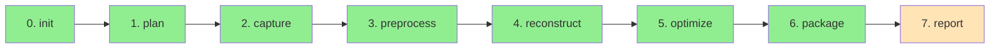

# scan2mesh

> RealSenseカメラで撮るだけで、シミュレーション・機械学習用の3Dアセットを生成するCLIツール

scan2meshは、Intel RealSenseカメラを用いた3Dスキャンから、シミュレーション・機械学習に使える高品質な3Dメッシュを自動生成するPythonパイプラインです。

## 特徴

- **品質ゲート付きパイプライン**: 各ステージで品質を自動判定し、「使える/要注意/使えない」を明確化
- **再現可能なアセット生成**: 同じ入力・設定から同じ出力を得られる決定論的なパイプライン
- **段階的な処理**: 8つのステージに分割された柔軟なワークフロー
- **CLI優先設計**: すべての機能がコマンドラインから実行可能
- **型安全**: Pydantic v2による堅牢なデータモデル

## 開発ステータス

**現在のバージョン**: 0.1.0 (Alpha)

### 実装状況

| Stage | ステージ名 | ステータス | 説明 |
|-------|-----------|----------|------|
| 0 | init | ✅ 完全実装 | プロジェクト初期化 |
| 1 | plan | ✅ 完全実装 | 撮影計画生成 |
| 2 | capture | ✅ 完全実装 | RGBDフレーム取得 |
| 3 | preprocess | ✅ 完全実装 | 前処理・背景除去 |
| 4 | reconstruct | ✅ 完全実装 | 3D復元 |
| 5 | optimize | ✅ 完全実装 | アセット最適化 |
| 6 | package | ✅ 完全実装 | パッケージング |
| 7 | report | 🚧 スタブのみ | 品質レポート |

### ロードマップ

| フェーズ | 内容 | ステータス |
|---------|------|----------|
| Phase 1 | init, plan の完全実装 | ✅ 完了 |
| Phase 2 | capture, preprocess の実装 | ✅ 完了 |
| Phase 3 | reconstruct, optimize の実装 | ✅ 完了 |
| Phase 4 | package, report の実装 | 🚧 進行中 |
| Phase 5 | Docker環境の整備 | 📋 予定 |

## パイプライン構成

scan2meshは8つのステージ（Stage 0: init から Stage 7: report）からなるパイプライン構造を採用しています。



### Stage 0: プロジェクト初期化 (init) ✅

プロジェクトディレクトリと設定ファイルを作成します。

**機能**:
- プロジェクト構造の生成（7つのディレクトリ）
- オブジェクト情報の登録（名前、クラスID、タグ）
- スケール情報の設定（既知寸法またはRealSenseスケール）
- 設定ハッシュの生成（再現性の確保）

**出力**:
- `project.json`: プロジェクト設定
- 7つの作業ディレクトリ（raw_frames, keyframes, masked_frames, recon, asset, metrics, logs）

### Stage 1: 撮影計画生成 (plan) ✅

最適な撮影視点を自動生成します。

**プリセット**:

| プリセット | 視点数 | 仰角パターン | 最低フレーム数 | 推奨用途 |
|-----------|--------|------------|--------------|---------|
| QUICK | 16 | 2段階 (0°, 30°) | 12 | 簡単な物体 |
| STANDARD | 36 | 3段階 (-15°, 15°, 45°) | 20 | 標準的な物体（推奨） |
| HARD | 48 | 4段階 (-30°, 0°, 30°, 60°) | 30 | 複雑な物体 |

**出力**:
- `capture_plan.json`: 撮影計画
  - 視点リスト（方位角、仰角、距離）
  - 最低必要フレーム数
  - 撮影順序
  - 撮影時の注意事項

### Stage 2: RGBDフレーム取得 (capture) ✅

RealSenseカメラからRGB-Dデータを取得します。

**機能**:
- RealSenseストリームの取得（RGB、Depth、intrinsics）
- リアルタイム品質評価（ブラースコア、深度有効率、オブジェクト占有率）
- キーフレームの自動選別（品質基準に基づく）
- 視点カバレッジの推定
- 品質ゲートによるPASS/WARN/FAIL判定
- モックカメラによる開発・テスト対応

**品質評価基準**:
- ブラースコア: Laplacian分散による鮮鋭度評価
- 深度有効率: 有効な深度ピクセルの割合
- オブジェクト占有率: 対象物体の画像内占有割合

**出力**:
- `raw_frames/`: RGB画像（PNG）と深度データ（.npy）
- `metrics/capture_metrics.json`: キャプチャメトリクス

### Stage 3: 前処理 (preprocess) ✅

撮影データから背景を除去し、復元に最適な状態に整えます。

**機能**:
- 深度閾値による背景除去
- マスク画像の生成と保存
- マスク品質の評価（有効面積比率）
- 品質ゲートによるPASS/WARN/FAIL判定

**出力**:
- `masked_frames/`: マスク適用済みRGB画像、深度データ、マスク画像
- `metrics/preprocess_metrics.json`: 前処理メトリクス

### Stage 4: 3D復元 (reconstruct) ✅

前処理済みのRGBDデータから3Dメッシュを生成します。

**機能**:
- RGBDオドメトリによるカメラ姿勢推定
- TSDF (Truncated Signed Distance Function) フュージョン
- Marching Cubesによるメッシュ抽出
- 追跡成功率・アライメントRMSE・ドリフト指標の計測
- 品質ゲートによるPASS/WARN/FAIL判定

**パラメータ**:

| パラメータ | デフォルト | 説明 |
|-----------|----------|------|
| `voxel_size` | 0.002m (2mm) | TSDFボクセルサイズ |
| `sdf_trunc` | 0.01m (10mm) | TSDF切り捨て距離 |

**品質評価基準**:

| 指標 | PASS | WARN | FAIL |
|------|------|------|------|
| 追跡成功率 | ≥90% | ≥70% | <70% |
| アライメントRMSE | ≤0.01m | ≤0.02m | >0.02m |
| ドリフト指標 | ≤0.05m | ≤0.1m | >0.1m |
| メッシュ三角形数 | ≥1000 | - | <1000 |

**出力**:
- `recon/mesh.ply`: 3Dメッシュ（PLY形式）
- `recon/recon_report.json`: 復元レポート（姿勢、メトリクス、品質ステータス）

### Stage 5: アセット最適化 (optimize) ✅

生成されたメッシュをシミュレーション・学習に適した形式に最適化します。

**機能**:
- スケール確定（既知寸法またはRealSenseスケール）
- 軸/原点の正規化（Z-up、底面中心原点）
- メッシュ修正（法線一貫性、非多様体エッジ除去、孤立頂点除去）
- LOD生成（LOD0: ~100k, LOD1: ~30k, LOD2: ~10k三角形）
- 衝突メッシュ生成（Convex hull）
- プレビュー画像生成
- 品質ゲートによるPASS/WARN/FAIL判定

**品質評価基準**:

| 指標 | PASS | WARN | FAIL |
|------|------|------|------|
| 穴面積比 | ≤1% | ≤5% | >5% |
| 非多様体エッジ数 | 0 | ≤10 | >10 |
| LOD0三角形数 | ≥1000 | - | <1000 |
| スケール不確実性 | low | medium | high |
| LOD0ポリゴン数 | ≤100k | >100k | - |

**出力**:
- `asset/lod0.glb`: LOD0メッシュ（GLB形式）
- `asset/lod1.glb`: LOD1メッシュ
- `asset/lod2.glb`: LOD2メッシュ
- `asset/collision.glb`: 衝突メッシュ
- `asset/preview.png`: プレビュー画像
- `metrics/asset_metrics.json`: アセットメトリクス

### Stage 6: パッケージング (package) ✅

最適化されたアセットを配布可能な形式でパッケージングします。

**機能**:
- アセットマニフェスト生成（メタデータ、品質ステータス、来歴）
- 規定のバンドル構造生成（output/ディレクトリ）
- ZIP圧縮アーカイブ作成

**出力**:
- `output/manifest.json`: アセットマニフェスト
- `output/lod0.glb`, `output/lod1.glb`, `output/lod2.glb`: LODメッシュ
- `output/collision.glb`: 衝突メッシュ
- `output/preview.png`: プレビュー画像
- `{object_name}_{class_id}.zip`: 配布用アーカイブ

### Stage 7: 品質レポート (report) 🚧

生成されたアセットの品質と次に取るべきアクションを提示します。

**予定機能**:
- キャプチャ品質の表示
- 復元品質の表示
- アセット品質の表示
- 総合判定（PASS/WARN/FAIL）
- 次アクションの提案

## インストール

### 前提条件

- Python 3.10以上
- uv（推奨パッケージマネージャ）

### uvのインストール

```bash
# macOS/Linux
curl -LsSf https://astral.sh/uv/install.sh | sh

# Windows (PowerShell)
irm https://astral.sh/uv/install.ps1 | iex
```

### scan2meshのインストール

```bash
# リポジトリをクローン
git clone https://github.com/scan2mesh/scan2mesh.git
cd scan2mesh

# 依存関係をインストール
uv sync

# CLIが使えることを確認
uv run scan2mesh --help
```

### 開発環境のセットアップ

```bash
# 開発用依存関係（テスト、リント等）を含めてインストール
uv sync --all-extras

# テストを実行して確認
uv run pytest
```

## クイックスタート

### 1. プロジェクトの初期化

新しいスキャンプロジェクトを作成します。

```bash
uv run scan2mesh init \
  --name robocup_ball \
  --class-id 0 \
  --tags ball,robocup \
  --dimension 220 \
  --dimension-type diameter
```

**生成されるディレクトリ構造**:

```
./projects/robocup_ball/
├── project.json          # プロジェクト設定
├── raw_frames/           # 生フレームデータ
├── keyframes/            # キーフレーム
├── masked_frames/        # マスク適用済みフレーム
├── recon/                # 復元結果
├── asset/                # 最適化済みアセット
├── metrics/              # メトリクス
└── logs/                 # ログ
```

### 2. 撮影計画の生成

プロジェクトの撮影計画を生成します。

```bash
uv run scan2mesh plan ./projects/robocup_ball --preset standard
```

**生成されるファイル**:

`./projects/robocup_ball/capture_plan.json`:

```json
{
  "preset": "standard",
  "viewpoints": [
    {
      "index": 0,
      "azimuth_deg": 0.0,
      "elevation_deg": -15.0,
      "distance_m": 0.4,
      "order": 0
    }
  ],
  "min_required_frames": 20,
  "recommended_distance_m": 0.4,
  "notes": [...]
}
```

### 3. RGBDフレームの取得

撮影計画に基づいてRGB-Dフレームを取得します。

```bash
# モックカメラで30フレーム取得（開発・テスト用）
uv run scan2mesh capture ./projects/robocup_ball --mock --num-frames 30

# RealSenseカメラで取得（実機が必要）
uv run scan2mesh capture ./projects/robocup_ball --num-frames 50
```

### 4. 前処理の実行

撮影データから背景を除去します。

```bash
uv run scan2mesh preprocess ./projects/robocup_ball
```

### 5. 3D復元の実行

前処理済みデータから3Dメッシュを生成します。

```bash
# 標準設定で復元
uv run scan2mesh reconstruct ./projects/robocup_ball

# カスタムパラメータで復元（高精度設定）
uv run scan2mesh reconstruct ./projects/robocup_ball \
  --voxel-size 0.001 \
  --sdf-trunc 0.005
```

### 6. アセット最適化の実行

復元されたメッシュを最適化し、LODと衝突メッシュを生成します。

```bash
uv run scan2mesh optimize ./projects/robocup_ball
```

### 7. パッケージングの実行

アセットをZIPアーカイブとしてパッケージングします。

```bash
uv run scan2mesh package ./projects/robocup_ball
```

### 次のステップ

現在実装済みの機能は `init`, `plan`, `capture`, `preprocess`, `reconstruct`, `optimize`, `package` です。
Stage 7 (report) は開発中のため、以下のコマンドは `NotImplementedError` を発生させます:

```bash
# これは現在動作しません
uv run scan2mesh report ./projects/robocup_ball
```

## コマンドリファレンス

### scan2mesh init

新しいスキャンプロジェクトを初期化します。

**構文**:
```bash
scan2mesh init --name NAME --class-id ID [OPTIONS]
```

**必須オプション**:

| オプション | 短縮形 | 型 | 説明 |
|-----------|--------|-----|------|
| `--name` | `-n` | TEXT | オブジェクト名（英数字、アンダースコア、ハイフンのみ） |
| `--class-id` | `-c` | INTEGER | クラスID (0-9999) |

**任意オプション**:

| オプション | 短縮形 | 型 | デフォルト | 説明 |
|-----------|--------|-----|----------|------|
| `--project-dir` | `-d` | PATH | `./projects` | プロジェクトベースディレクトリ |
| `--tags` | `-t` | TEXT | なし | タグ（カンマ区切り） |
| `--dimension` | - | FLOAT | なし | 既知の寸法（mm） |
| `--dimension-type` | - | TEXT | なし | 寸法の種類（width/height/depth/diameter） |

**使用例**:

```bash
# 基本的な使用
uv run scan2mesh init --name ball --class-id 0

# タグと既知寸法を指定
uv run scan2mesh init \
  --name robocup_ball \
  --class-id 0 \
  --tags ball,robocup \
  --dimension 220 \
  --dimension-type diameter
```

### scan2mesh plan

プロジェクトの撮影計画を生成します。

**構文**:
```bash
scan2mesh plan PROJECT_DIR [OPTIONS]
```

**引数**:

| 引数 | 型 | 説明 |
|------|-----|------|
| `PROJECT_DIR` | PATH | プロジェクトディレクトリのパス |

**オプション**:

| オプション | 短縮形 | 型 | デフォルト | 説明 |
|-----------|--------|-----|----------|------|
| `--preset` | `-p` | TEXT | `standard` | 撮影プリセット（quick/standard/hard） |

**プリセットの詳細**:

| プリセット | 視点数 | 方位角分割 | 仰角パターン | 最低フレーム数 | 推奨距離 |
|-----------|--------|-----------|------------|--------------|---------|
| `quick` | 16 | 8分割 | 2段階 (0°, 30°) | 12 | 0.4m |
| `standard` | 36 | 12分割 | 3段階 (-15°, 15°, 45°) | 20 | 0.4m |
| `hard` | 48 | 12分割 | 4段階 (-30°, 0°, 30°, 60°) | 30 | 0.35m |

**使用例**:

```bash
# 標準プリセット（推奨）
uv run scan2mesh plan ./projects/robocup_ball

# クイックプリセット（短時間撮影）
uv run scan2mesh plan ./projects/ball --preset quick

# ハードプリセット（複雑な物体）
uv run scan2mesh plan ./projects/complex_object --preset hard
```

### scan2mesh capture

RGBDフレームを取得します。

**構文**:
```bash
scan2mesh capture PROJECT_DIR [OPTIONS]
```

**引数**:

| 引数 | 型 | 説明 |
|------|-----|------|
| `PROJECT_DIR` | PATH | プロジェクトディレクトリのパス |

**オプション**:

| オプション | 短縮形 | 型 | デフォルト | 説明 |
|-----------|--------|-----|----------|------|
| `--num-frames` | `-n` | INTEGER | 30 | 取得するフレーム数 |
| `--mock` | - | BOOLEAN | False | モックカメラを使用（開発・テスト用） |

**品質ゲート**:

取得したフレームは自動的に品質評価され、以下の判定が行われます:

| 判定 | 説明 |
|------|------|
| PASS | 品質基準を満たしている |
| WARN | 品質基準を下回るが使用可能 |
| FAIL | 品質基準を大幅に下回り、再撮影推奨 |

**使用例**:

```bash
# モックカメラで30フレーム取得（開発用）
uv run scan2mesh capture ./projects/ball --mock

# 50フレーム取得
uv run scan2mesh capture ./projects/ball --num-frames 50

# RealSenseカメラで取得
uv run scan2mesh capture ./projects/ball
```

### scan2mesh preprocess

前処理（背景除去）を実行します。

**構文**:
```bash
scan2mesh preprocess PROJECT_DIR [OPTIONS]
```

**引数**:

| 引数 | 型 | 説明 |
|------|-----|------|
| `PROJECT_DIR` | PATH | プロジェクトディレクトリのパス |

**オプション**:

| オプション | 短縮形 | 型 | デフォルト | 説明 |
|-----------|--------|-----|----------|------|
| `--depth-min` | - | INTEGER | 200 | 最小深度閾値（mm） |
| `--depth-max` | - | INTEGER | 1000 | 最大深度閾値（mm） |

**品質ゲート**:

| 判定 | 説明 |
|------|------|
| PASS | マスク品質が基準を満たしている |
| WARN | マスク品質が低下しているが使用可能 |
| FAIL | マスク品質が基準を下回り、再撮影推奨 |

**使用例**:

```bash
# デフォルト設定で前処理
uv run scan2mesh preprocess ./projects/ball

# カスタム深度閾値
uv run scan2mesh preprocess ./projects/ball --depth-min 100 --depth-max 500
```

### scan2mesh reconstruct

3D復元を実行します。

**構文**:
```bash
scan2mesh reconstruct PROJECT_DIR [OPTIONS]
```

**引数**:

| 引数 | 型 | 説明 |
|------|-----|------|
| `PROJECT_DIR` | PATH | プロジェクトディレクトリのパス |

**オプション**:

| オプション | 短縮形 | 型 | デフォルト | 説明 |
|-----------|--------|-----|----------|------|
| `--voxel-size` | - | FLOAT | 0.002 | TSDFボクセルサイズ（メートル） |
| `--sdf-trunc` | - | FLOAT | 0.01 | TSDF切り捨て距離（メートル） |

**品質ゲート**:

| 判定 | 条件 |
|------|------|
| PASS | 追跡成功率≥90%, アライメントRMSE≤0.01m, ドリフト≤0.05m, 三角形≥1000 |
| WARN | 追跡成功率≥70%, アライメントRMSE≤0.02m, ドリフト≤0.1m |
| FAIL | 上記の条件を満たさない |

**使用例**:

```bash
# デフォルト設定で復元
uv run scan2mesh reconstruct ./projects/ball

# 高精度設定（ボクセルサイズ1mm）
uv run scan2mesh reconstruct ./projects/ball --voxel-size 0.001 --sdf-trunc 0.005

# 高速設定（ボクセルサイズ5mm）
uv run scan2mesh reconstruct ./projects/ball --voxel-size 0.005 --sdf-trunc 0.02
```

### scan2mesh optimize

アセット最適化を実行します。

**構文**:
```bash
scan2mesh optimize PROJECT_DIR
```

**引数**:

| 引数 | 型 | 説明 |
|------|-----|------|
| `PROJECT_DIR` | PATH | プロジェクトディレクトリのパス |

**処理内容**:

1. **座標軸正規化**: Z-up、原点を底面中心に移動
2. **スケール適用**: 既知寸法またはRealSenseスケールを適用
3. **メッシュ修正**: 法線一貫性確保、非多様体エッジ除去
4. **LOD生成**: 3段階のLOD（100k, 30k, 10k三角形）
5. **衝突メッシュ生成**: Convex hull
6. **プレビュー画像生成**: メッシュの代表ビュー

**品質ゲート**:

| 判定 | 条件 |
|------|------|
| PASS | 穴面積比≤1%, 非多様体エッジ=0, LOD0三角形≥1000, スケール不確実性=low |
| WARN | 穴面積比≤5%, 非多様体エッジ≤10, LOD0>100kポリゴン, スケール不確実性≠low |
| FAIL | 上記の条件を満たさない |

**使用例**:

```bash
# アセット最適化を実行
uv run scan2mesh optimize ./projects/ball
```

### scan2mesh package

パッケージングを実行します。

**構文**:
```bash
scan2mesh package PROJECT_DIR
```

**引数**:

| 引数 | 型 | 説明 |
|------|-----|------|
| `PROJECT_DIR` | PATH | プロジェクトディレクトリのパス |

**処理内容**:

1. **マニフェスト生成**: 全ステージのメトリクスを統合したmanifest.jsonを生成
2. **バンドル構造作成**: output/ディレクトリにアセットファイルをコピー
3. **ZIP圧縮**: `{object_name}_{class_id}.zip`形式でアーカイブ作成

**使用例**:

```bash
# パッケージングを実行
uv run scan2mesh package ./projects/ball
```

### 未実装コマンド

以下のコマンドは現在開発中です（スタブのみ実装）:

| コマンド | 説明 |
|---------|------|
| `scan2mesh report PROJECT_DIR` | 品質レポートの生成 |

## プロジェクト構造

### プロジェクトディレクトリ

`scan2mesh init` で作成されるプロジェクトディレクトリの構造:

```
project_name/
├── project.json              # プロジェクト設定
├── capture_plan.json         # 撮影計画（plan実行後）
├── raw_frames/               # 生フレームデータ
├── keyframes/                # キーフレーム
├── masked_frames/            # マスク適用済みフレーム
├── recon/                    # 復元結果
├── asset/                    # 最適化済みアセット
├── metrics/                  # メトリクス
└── logs/                     # ログ
```

### リポジトリ構造

```
scan2mesh/
├── src/scan2mesh/            # メインパッケージ
│   ├── cli/                  # CLIレイヤー
│   │   ├── commands.py       # コマンド実装
│   │   ├── display.py        # 出力表示
│   │   └── validators.py     # 入力検証
│   ├── orchestrator/         # パイプラインオーケストレーター
│   ├── stages/               # 処理ステージ
│   │   ├── init.py           # ✅ ProjectInitializer
│   │   ├── plan.py           # ✅ CapturePlanner
│   │   ├── capture.py        # ✅ RGBDCapture
│   │   ├── preprocess.py     # ✅ Preprocessor
│   │   ├── reconstruct.py    # ✅ Reconstructor
│   │   ├── optimize.py       # ✅ AssetOptimizer
│   │   ├── package.py        # 🚧 Packager (stub)
│   │   └── report.py         # 🚧 QualityReporter (stub)
│   ├── services/             # 共通サービス
│   ├── models/               # データモデル (Pydantic)
│   ├── gates/                # 品質ゲート
│   └── utils/                # ユーティリティ
├── tests/                    # テストコード
├── docs/                     # プロジェクトドキュメント
├── pyproject.toml            # プロジェクト設定
└── README.md                 # このファイル
```

## 技術スタック

### 現在使用中

| ライブラリ | バージョン | 用途 |
|----------|-----------|------|
| Typer | 0.12+ | CLIフレームワーク |
| Pydantic | 2.6+ | データモデル・バリデーション |
| Rich | 13.7+ | CLI出力（プログレスバー、テーブル） |
| NumPy | 1.26+ | 数値計算 |
| PyYAML | 6.0+ | 設定ファイル読み込み |

### 将来使用予定（Stage 2以降）

| ライブラリ | 用途 | 必要なステージ |
|----------|------|--------------|
| pyrealsense2 | RealSense制御 | Stage 2 (capture) |
| Open3D | 3D処理（RGBD、TSDF、メッシュ） | Stage 3-5 |
| OpenCV | 画像処理 | Stage 2-3 |
| trimesh | メッシュ操作 | Stage 5 |
| pymeshlab | メッシュ修正 | Stage 5 |
| pygltflib | glTFエクスポート | Stage 6 |

### 開発ツール

| ツール | 用途 |
|-------|------|
| pytest | テストフレームワーク |
| mypy | 型チェック（strict mode） |
| Ruff | リンター・フォーマッター |
| pytest-cov | カバレッジ測定 |

## 開発

### テストの実行

```bash
# すべてのテストを実行
uv run pytest

# カバレッジ付きで実行
uv run pytest --cov=src/scan2mesh --cov-report=term-missing
```

### リント・フォーマット

```bash
# Ruffでリント
uv run ruff check src tests

# 自動修正
uv run ruff check --fix src tests

# フォーマット
uv run ruff format src tests
```

### 型チェック

```bash
# mypyで型チェック（strict mode）
uv run mypy src/scan2mesh
```

### ドキュメント

プロジェクトの設計ドキュメントは `docs/` ディレクトリにあります:

- [プロダクト要求定義書](docs/product-requirements.md)
- [機能設計書](docs/functional-design.md)
- [技術仕様書](docs/architecture.md)
- [リポジトリ構造定義書](docs/repository-structure.md)
- [開発ガイドライン](docs/development-guidelines.md)
- [用語集](docs/glossary.md)

## ライセンス

このプロジェクトはMITライセンスの下で公開されています。
詳細は [LICENSE](LICENSE) ファイルを参照してください。
