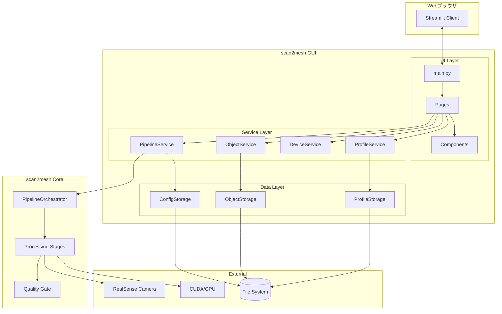

# 技術仕様書 (Architecture Design Document)

## テクノロジースタック

### 言語・ランタイム

| 技術 | バージョン | 選定理由 |
|------|-----------|----------|
| Python | 3.10+ | scan2mesh Coreとの統一。型ヒントが充実し、静的型チェックが可能 |
| CUDA | 12.2 (オプション) | Open3DのGPU高速化。CPU環境でも動作可能だが処理速度は低下 |

### フレームワーク・ライブラリ

| 技術 | バージョン | 用途 | 選定理由 |
|------|-----------|------|----------|
| Streamlit | 1.28+ | GUIフレームワーク | hsr-perception-robocupとの統一。Pythonのみで高速にWebUI構築可能。リアルタイム更新対応 |
| Pydantic | 2.6+ | データモデル・検証 | scan2mesh Coreとの統一。型安全な設定管理、JSONシリアライズ |
| Plotly | 5.0+ | グラフ・チャート | インタラクティブなメトリクス可視化。Streamlitとの親和性が高い |
| streamlit-extras | 0.3+ | UI拡張 | カード、バッジ、スイッチなど追加UIコンポーネント |
| PyVista | 0.42+ | 3Dビューア | 点群・メッシュのインタラクティブ表示。VTK basedで高性能 |
| stpyvista | 0.0.5+ | Streamlit 3D連携 | PyVistaをStreamlitに統合 |
| Pillow | 10.0+ | 画像処理 | 画像表示、リサイズ、フォーマット変換 |

### scan2mesh Core依存

| 技術 | バージョン | 用途 | 備考 |
|------|-----------|------|------|
| pyrealsense2 | 2.55+ | RealSense制御 | scan2mesh Coreと共有 |
| Open3D | 0.18+ | 3D処理 | scan2mesh Coreと共有、CPU/GPU両対応 |
| OpenCV | 4.9+ | 画像処理 | scan2mesh Coreと共有 |
| NumPy | 1.26+ | 数値計算 | scan2mesh Coreと共有 |
| trimesh | 4.4+ | メッシュ操作 | scan2mesh Coreと共有 |

### コンテナ・インフラ

| 技術 | バージョン | 用途 | 選定理由 |
|------|-----------|------|----------|
| Docker | 24.0+ | コンテナランタイム | 環境の再現性、異なるデバイス間での共有 |
| Docker Compose | 2.20+ | コンテナオーケストレーション | 複数サービス定義、ボリューム管理 |
| NVIDIA Container Toolkit | 1.14+ | GPU対応（オプション） | コンテナ内からNVIDIA GPUへアクセス |

### 開発ツール

| 技術 | バージョン | 用途 | 選定理由 |
|------|-----------|------|----------|
| uv | 0.4+ | パッケージ管理 | scan2mesh Coreとの統一。高速な依存解決 |
| Ruff | 0.3+ | リンター・フォーマッター | 高速なPythonリンター、Black互換 |
| pytest | 8.0+ | テストフレームワーク | Pythonデファクトスタンダード |
| mypy | 1.9+ | 型チェック | 静的型検査による品質向上 |

## アーキテクチャパターン

### レイヤードアーキテクチャ

```
┌─────────────────────────────────────────────────────────────────────────┐
│                          UI Layer (Streamlit)                           │
│  (ページ描画、ユーザー入力、状態管理、進捗表示)                             │
└─────────────────────────────────────────────────────────────────────────┘
                                    │
                                    ▼
┌─────────────────────────────────────────────────────────────────────────┐
│                          Service Layer                                   │
│  (ProfileService, ObjectService, DeviceService, PipelineService)         │
└─────────────────────────────────────────────────────────────────────────┘
                                    │
                    ┌───────────────┴───────────────┐
                    ▼                               ▼
┌───────────────────────────────┐   ┌───────────────────────────────────┐
│        Data Layer             │   │        scan2mesh Core              │
│  (JSON Storage, File I/O)     │   │  (Pipeline Orchestrator, Stages)   │
└───────────────────────────────┘   └───────────────────────────────────┘
                    │                               │
                    ▼                               ▼
┌───────────────────────────────┐   ┌───────────────────────────────────┐
│      File System              │   │      External Devices              │
│  (profiles/, projects/)       │   │  (RealSense, GPU)                  │
└───────────────────────────────┘   └───────────────────────────────────┘
```

### レイヤー定義

#### UI Layer (Streamlit)

- **責務**: ページ描画、ユーザー入力受付、状態管理、進捗表示
- **許可される操作**: Service Layerの呼び出し、session_stateの管理
- **禁止される操作**: Data Layerへの直接アクセス、scan2mesh Coreの直接呼び出し

```python
# UI Layer の設計方針
# pages/capture.py
import streamlit as st
from services.pipeline_service import PipelineService

def render_capture_page():
    """撮影ページを描画"""
    pipeline = PipelineService()

    # OK: Service Layerを呼び出す
    if st.button("撮影開始"):
        pipeline.start_capture(
            st.session_state.current_project,
            on_frame=update_preview,
            on_quality=update_metrics
        )

    # NG: scan2mesh Coreを直接呼び出す
    # from scan2mesh.stages import RGBDCapture  # ❌
```

#### Service Layer

- **責務**: ビジネスロジック、データ変換、scan2mesh Coreとの連携
- **許可される操作**: Data Layerの呼び出し、scan2mesh Coreの呼び出し
- **禁止される操作**: UI Layerへの依存、Streamlit APIの使用

```python
# Service Layer の設計方針
# services/pipeline_service.py
from scan2mesh.orchestrator import PipelineOrchestrator
from data.project_storage import ProjectStorage

class PipelineService:
    def __init__(self, projects_dir: Path):
        self.storage = ProjectStorage(projects_dir)
        self.orchestrator = PipelineOrchestrator()

    def start_capture(self, project_path: Path,
                      on_frame: Callable,
                      on_quality: Callable) -> None:
        """撮影を開始（コールバックで進捗通知）"""
        config = self.storage.load_config(project_path)
        plan = self.storage.load_plan(project_path)
        self.orchestrator.run_capture(config, plan, on_frame, on_quality)
```

#### Data Layer

- **責務**: データの永続化、取得、ファイルI/O
- **許可される操作**: ファイルシステムへのアクセス
- **禁止される操作**: ビジネスロジックの実装

```python
# Data Layer の設計方針
# data/profile_storage.py
class ProfileStorage:
    def __init__(self, profiles_dir: Path):
        self.profiles_dir = profiles_dir

    def save_profile(self, profile: Profile) -> None:
        """プロファイルを保存"""
        profile_dir = self.profiles_dir / profile.id
        profile_dir.mkdir(parents=True, exist_ok=True)
        profile_file = profile_dir / "profile.json"
        with open(profile_file, 'w') as f:
            json.dump(profile.model_dump(), f, indent=2, default=str)

    def load_profile(self, profile_id: str) -> Optional[Profile]:
        """プロファイルを読み込み"""
        profile_file = self.profiles_dir / profile_id / "profile.json"
        if not profile_file.exists():
            return None
        with open(profile_file) as f:
            data = json.load(f)
        return Profile(**data)
```

## コンポーネント図



## データ永続化戦略

### ストレージ方式

| データ種別 | ストレージ | フォーマット | 理由 |
|-----------|----------|-------------|------|
| プロファイル設定 | JSONファイル | JSON | 人間可読、バージョン管理可能 |
| オブジェクト設定 | JSONファイル | JSON | 構造化データ、編集可能 |
| アプリケーション設定 | JSONファイル | JSON | 人間可読、手動編集可能 |
| 参照画像 | 画像ファイル | PNG/JPG | 汎用形式、プレビュー表示 |
| スキャンプロジェクト | scan2mesh形式 | 各種 | scan2mesh Coreと共有 |
| セッション状態 | メモリ | Python dict | Streamlit session_state |

### ファイルシステム構造

```
scan2mesh-gui/
├── profiles/                       # プロファイルデータ（永続化）
│   └── {profile_id}/
│       ├── profile.json            # プロファイル設定
│       └── objects/
│           └── {object_id}/
│               ├── object.json     # オブジェクト設定
│               └── reference/      # 参照画像
│
├── projects/                       # scan2meshプロジェクト（永続化）
│   └── {object_id}/               # scan2mesh標準構造
│       ├── project.json
│       ├── capture_plan.json
│       ├── raw_frames/
│       ├── masked_frames/
│       ├── recon/
│       ├── asset/
│       └── metrics/
│
├── output/                         # 出力バンドル（一時）
│
├── config/
│   └── app_config.json            # アプリケーション設定
│
└── logs/
    └── scan2mesh_gui.log          # アプリケーションログ
```

### データ整合性

- **アトミック書き込み**: 一時ファイルに書き込み後、リネームで置換
- **バリデーション**: Pydanticモデルで読み込み時に検証
- **エラーリカバリー**: 破損ファイル検出時はバックアップから復元

```python
# アトミック書き込みの例
def save_json_atomic(path: Path, data: dict) -> None:
    temp_path = path.with_suffix('.tmp')
    with open(temp_path, 'w') as f:
        json.dump(data, f, indent=2, default=str)
    temp_path.rename(path)  # アトミックな置換
```

## パフォーマンス要件

### レスポンスタイム

| 操作 | 目標時間 | 測定環境 | 備考 |
|------|---------|---------|------|
| ページ読み込み | 3秒以内 | 標準環境 | 初回ロード |
| ページ遷移 | 1秒以内 | 標準環境 | キャッシュ有効時 |
| カメラプレビュー | 66ms以内 | 15fps | リアルタイム表示 |
| 品質メトリクス更新 | 100ms以内 | - | リアルタイム |
| 3Dメッシュ表示 | 2秒以内 | 100k tris | 初回レンダリング |
| 3Dメッシュ操作 | 16ms以内 | 60fps | 回転・ズーム |
| プロファイル一覧 | 500ms以内 | 100件 | ページネーション |
| オブジェクト一覧 | 500ms以内 | 1000件 | フィルタリング込み |

### リソース使用量

| リソース | 上限 | 理由 |
|---------|------|------|
| メモリ (GUI) | 2GB | Streamlit + 画像キャッシュ |
| メモリ (処理時) | 8GB | scan2mesh Core処理時 |
| VRAM | 4GB | GPU使用時のOpen3D処理 |
| ディスク (アプリ) | 500MB | インストールサイズ |
| ディスク (プロジェクト) | 5GB/プロジェクト | 100フレーム撮影時 |
| CPU使用率 (アイドル) | 5%以下 | バックグラウンド時 |
| CPU使用率 (プレビュー) | 30%以下 | カメラプレビュー表示時 |

### 最適化戦略

```python
# 画像キャッシュ
@st.cache_data(ttl=300)
def load_preview_image(path: str) -> np.ndarray:
    """プレビュー画像をキャッシュ付きで読み込み"""
    return cv2.imread(path)

# 重い処理の非同期実行
def run_reconstruct_async(project_path: Path):
    """復元処理を別スレッドで実行"""
    with concurrent.futures.ThreadPoolExecutor() as executor:
        future = executor.submit(pipeline.run_reconstruct, project_path)
        while not future.done():
            st.session_state.progress = get_progress()
            time.sleep(0.1)
        return future.result()

# 3Dメッシュの軽量化表示
def load_mesh_for_preview(path: Path, max_triangles: int = 50000):
    """プレビュー用に軽量化したメッシュを読み込み"""
    mesh = trimesh.load(path)
    if len(mesh.faces) > max_triangles:
        mesh = mesh.simplify_quadric_decimation(max_triangles)
    return mesh
```

## セキュリティアーキテクチャ

### データ保護

- **ローカル完結（必須）**: すべての処理はローカルマシン上で完結。外部サーバーへのデータ送信は一切行わない
- **ファイルパーミッション**: プロファイル・プロジェクトディレクトリは700（所有者のみ）
- **一時ファイル**: プロジェクト内の`tmp/`を使用し、処理後削除

### 入力検証

```python
# 入力検証の例
from pydantic import BaseModel, Field, field_validator

class ProfileCreate(BaseModel):
    name: str = Field(..., min_length=1, max_length=100)
    description: str = Field(default="", max_length=1000)
    tags: list[str] = Field(default_factory=list, max_length=20)

    @field_validator('name')
    def validate_name(cls, v):
        # パストラバーサル防止
        if '..' in v or '/' in v or '\\' in v:
            raise ValueError('Invalid characters in name')
        return v

    @field_validator('tags')
    def validate_tags(cls, v):
        for tag in v:
            if len(tag) > 50:
                raise ValueError('Tag too long')
        return v
```

### Streamlitセキュリティ

```python
# ファイルアップロードの検証
def validate_uploaded_image(uploaded_file) -> bool:
    """アップロードされた画像を検証"""
    # ファイルサイズ制限（10MB）
    if uploaded_file.size > 10 * 1024 * 1024:
        return False

    # MIMEタイプ検証
    allowed_types = ['image/png', 'image/jpeg', 'image/jpg']
    if uploaded_file.type not in allowed_types:
        return False

    # 画像として読み込めるか検証
    try:
        Image.open(uploaded_file)
        return True
    except:
        return False
```

### コンテナセキュリティ

- **非rootユーザー**: コンテナ内ではUID 1000で実行
- **読み取り専用**: システムディレクトリは読み取り専用マウント
- **ネットワーク**: 外部通信不可（localhost:8501のみ公開）

```dockerfile
# Dockerfile セキュリティ設定
RUN useradd -m -u 1000 scan2mesh
USER scan2mesh

# docker-compose.yml
security_opt:
  - no-new-privileges:true
networks:
  - internal  # 外部通信なし
```

## スケーラビリティ設計

### データ増加への対応

- **想定データ量**: プロファイル100件、オブジェクト1000件/プロファイル
- **パフォーマンス劣化対策**:
  - プロファイル・オブジェクト一覧のページネーション
  - 遅延読み込み（詳細情報は選択時に取得）
  - メタデータのインデックス化

```python
# ページネーション付きオブジェクト取得
def list_objects(profile_id: str,
                 page: int = 0,
                 page_size: int = 50,
                 filter_stage: Optional[str] = None) -> tuple[list[ScanObject], int]:
    """ページネーション付きでオブジェクト一覧を取得"""
    all_objects = self._load_all_objects(profile_id)

    if filter_stage:
        all_objects = [o for o in all_objects if o.current_stage == filter_stage]

    total = len(all_objects)
    start = page * page_size
    end = start + page_size

    return all_objects[start:end], total
```

### 機能拡張性

- **プラグインシステム**: 将来の拡張用にServiceインターフェースを定義
- **設定のカスタマイズ**: app_config.jsonで品質閾値等を変更可能
- **ページの追加**: `pages/`ディレクトリにファイルを追加するだけで新規ページ作成

```python
# Service インターフェース
from abc import ABC, abstractmethod

class PipelineServiceInterface(ABC):
    @abstractmethod
    def start_capture(self, project_path: Path, **kwargs) -> None:
        pass

    @abstractmethod
    def run_preprocess(self, project_path: Path, **kwargs) -> dict:
        pass

    # 将来の拡張: ターンテーブル連携
    def start_capture_with_turntable(self, project_path: Path, **kwargs) -> None:
        raise NotImplementedError("Turntable support not implemented")
```

## Docker環境アーキテクチャ

### イメージ構成

```
┌─────────────────────────────────────────────────────────────────────────┐
│                     scan2mesh-gui:cpu / scan2mesh-gui:gpu               │
├─────────────────────────────────────────────────────────────────────────┤
│  Streamlit Application                                                   │
│  - pages/                                                                │
│  - components/                                                           │
│  - services/                                                             │
├─────────────────────────────────────────────────────────────────────────┤
│  scan2mesh Core                                                          │
│  - CLI                                                                   │
│  - Orchestrator                                                          │
│  - Stages                                                                │
├─────────────────────────────────────────────────────────────────────────┤
│  Python 3.10 + Dependencies                                              │
│  - Streamlit, Pydantic, Plotly, PyVista                                 │
│  - Open3D, OpenCV, NumPy, trimesh                                       │
├─────────────────────────────────────────────────────────────────────────┤
│  Base Image                                                              │
│  - CPU: python:3.10-slim                                                │
│  - GPU: nvidia/cuda:12.2-runtime-ubuntu22.04                            │
└─────────────────────────────────────────────────────────────────────────┘
```

### docker-compose.yml 概要設計

```yaml
version: '3.8'

services:
  scan2mesh-gui:
    build:
      context: .
      dockerfile: docker/Dockerfile.cpu  # または Dockerfile.gpu
    image: scan2mesh-gui:cpu

    # ポート公開
    ports:
      - "8501:8501"

    # RealSenseカメラアクセス
    devices:
      - /dev/bus/usb:/dev/bus/usb
    privileged: true

    # データ永続化
    volumes:
      - ./profiles:/app/profiles
      - ./projects:/app/projects
      - ./output:/app/output
      - ./config:/app/config

    # 環境変数
    environment:
      - STREAMLIT_SERVER_PORT=8501
      - STREAMLIT_SERVER_ADDRESS=0.0.0.0
      - SCAN2MESH_LOG_LEVEL=INFO

    # ヘルスチェック
    healthcheck:
      test: ["CMD", "curl", "-f", "http://localhost:8501/_stcore/health"]
      interval: 30s
      timeout: 10s
      retries: 3

# GPU版の追加設定
services:
  scan2mesh-gui-gpu:
    extends:
      service: scan2mesh-gui
    build:
      dockerfile: docker/Dockerfile.gpu
    image: scan2mesh-gui:gpu
    deploy:
      resources:
        reservations:
          devices:
            - driver: nvidia
              count: 1
              capabilities: [gpu]
```

### CPU/GPU環境の切り替え

```bash
# CPU環境で起動
docker compose -f docker-compose.cpu.yml up

# GPU環境で起動
docker compose -f docker-compose.gpu.yml up

# または環境変数で切り替え
SCAN2MESH_MODE=gpu docker compose up
```

## テスト戦略

### ユニットテスト

- **フレームワーク**: pytest 8.0+
- **対象**:
  - Service Layer: ビジネスロジック
  - Data Layer: CRUD操作
  - データモデル: Pydanticバリデーション
- **カバレッジ目標**: 80%以上
- **モック**: RealSenseカメラ、scan2mesh Coreはモック化

```python
# テスト例
def test_profile_service_create():
    service = ProfileService(tmp_path / "profiles")
    profile = service.create_profile(
        name="Test Profile",
        description="Test description",
        tags=["test"]
    )
    assert profile.name == "Test Profile"
    assert profile.id is not None

def test_object_service_filter_by_stage():
    service = ObjectService(tmp_path / "profiles", tmp_path / "projects")
    # テストデータ作成
    objects = service.list_objects(
        profile_id="test",
        filter_stage=PipelineStage.CAPTURE
    )
    assert all(o.current_stage == PipelineStage.CAPTURE for o in objects)
```

### 統合テスト

- **方法**: Service Layer → Data Layer の連携テスト
- **対象**:
  - プロファイル作成 → オブジェクト追加 → プロジェクト初期化
  - 設定変更の永続化
  - エラーハンドリング

### E2Eテスト（chrome-devtools-mcp使用）

- **ツール**: chrome-devtools-mcp
- **シナリオ**:
  1. アプリ起動確認
  2. プロファイル作成フロー
  3. オブジェクト追加フロー
  4. ページ遷移確認
  5. エラー表示確認
  6. レスポンシブ表示確認

```python
# E2Eテストシナリオ例
async def test_create_profile_flow():
    # 1. Profilesページに遷移
    await page.click('[data-testid="nav-profiles"]')

    # 2. 新規プロファイル作成ボタンをクリック
    await page.click('[data-testid="btn-create-profile"]')

    # 3. フォーム入力
    await page.fill('[data-testid="input-profile-name"]', "Test Profile")
    await page.fill('[data-testid="input-profile-description"]', "Test")

    # 4. 作成ボタンをクリック
    await page.click('[data-testid="btn-submit"]')

    # 5. 成功メッセージを確認
    success = await page.wait_for_selector('[data-testid="success-message"]')
    assert "作成しました" in await success.text_content()
```

### テスト環境

| 環境 | 用途 | 備考 |
|------|------|------|
| ローカル | 開発時テスト | モックデバイス |
| CI (GitHub Actions) | ユニット・統合テスト | GPUなし |
| Docker (CPU) | E2Eテスト | chrome-devtools-mcp |
| Docker (GPU) | 統合テスト | 実デバイス |

## 技術的制約

### 環境要件

| 項目 | 要件 |
|------|------|
| OS | Ubuntu 22.04 LTS / 24.04 LTS |
| Docker | 24.0以上 |
| NVIDIA Driver | 525以上（GPU使用時） |
| ブラウザ | Chrome 120+ / Firefox 120+ / Edge 120+ |
| メモリ | 8GB以上（推奨16GB） |
| ディスク | 20GB以上の空き容量 |
| USB | USB 3.0ポート（RealSense用） |

### 対応カメラ

| モデル | ステータス | 備考 |
|--------|-----------|------|
| RealSense D415 | 対応 | 狭視野、高精度 |
| RealSense D435 | 対応（推奨） | 広視野、バランス良好 |
| RealSense D455 | 対応 | 長距離、IMU内蔵 |

### 既知の制限

- **同時アクセス**: シングルユーザー前提（マルチユーザー非対応）
- **モバイル**: スマートフォン・タブレット非対応
- **オフライン**: 完全オフライン動作（外部通信なし）
- **長時間処理**: ブラウザタイムアウト回避のためポーリング実装

## 依存関係管理

### バージョン管理方針

| ライブラリ | バージョン指定 | 理由 |
|-----------|---------------|------|
| streamlit | ^1.28.0 | 安定版、マイナー更新許可 |
| pydantic | ^2.6.0 | scan2mesh Coreと統一 |
| plotly | ^5.0.0 | 安定版 |
| pyvista | ^0.42.0 | 安定版 |
| pillow | ^10.0.0 | セキュリティ更新許可 |

### ロックファイル

- **uv.lock**: 全依存関係の正確なバージョンを固定
- **更新頻度**: セキュリティ更新時、または月次で確認
- **更新プロセス**: `uv lock --upgrade` → テスト実行 → コミット

## エラーハンドリング戦略

### エラー階層

```python
class Scan2MeshGUIError(Exception):
    """GUI基底エラークラス"""
    pass

class ProfileError(Scan2MeshGUIError):
    """プロファイル関連エラー"""
    pass

class ObjectError(Scan2MeshGUIError):
    """オブジェクト関連エラー"""
    pass

class DeviceError(Scan2MeshGUIError):
    """デバイス関連エラー"""
    pass

class PipelineError(Scan2MeshGUIError):
    """パイプライン実行エラー"""
    pass
```

### リカバリー戦略

| エラー種別 | リカバリー方法 |
|-----------|---------------|
| カメラ未接続 | 接続待機、再試行ボタン表示 |
| 品質ゲートFAIL | 詳細表示、再撮影提案 |
| GPU利用不可 | CPUフォールバック（警告表示） |
| ディスク不足 | 処理停止、空き容量確認を促す |
| セッション切断 | 自動再接続、状態復元 |

## ログ戦略

### ログレベル

| レベル | 用途 |
|--------|------|
| DEBUG | 開発時の詳細情報（API呼び出し、状態変更等） |
| INFO | 通常の処理進捗（ページ遷移、操作完了等） |
| WARNING | 品質ゲートWARN、パフォーマンス低下 |
| ERROR | 処理失敗、リカバリー可能なエラー |
| CRITICAL | 致命的エラー、アプリ停止 |

### ログ出力先

- **コンソール**: INFO以上（Streamlitターミナル）
- **ファイル**: DEBUG以上（`logs/scan2mesh_gui.log`、ローテーション）

```python
# ログ設定
import logging
from logging.handlers import RotatingFileHandler

logging.basicConfig(
    level=logging.INFO,
    format="%(asctime)s [%(levelname)s] %(name)s: %(message)s",
    handlers=[
        logging.StreamHandler(),
        RotatingFileHandler(
            "logs/scan2mesh_gui.log",
            maxBytes=10*1024*1024,  # 10MB
            backupCount=5
        )
    ]
)
```
