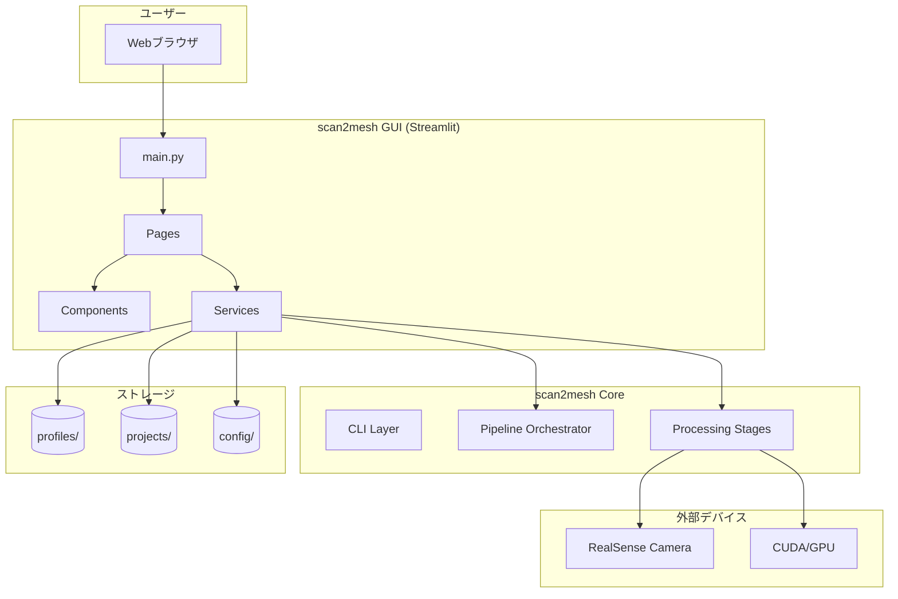
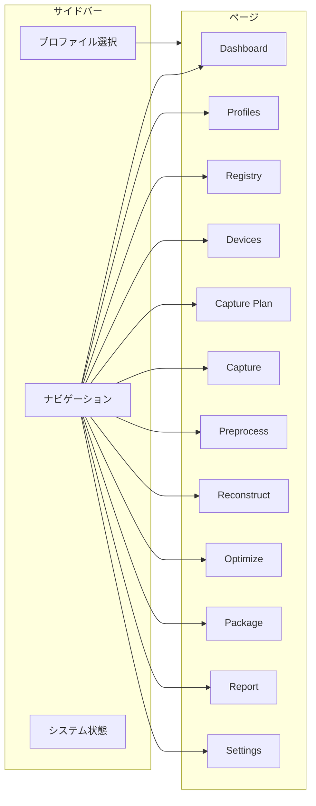
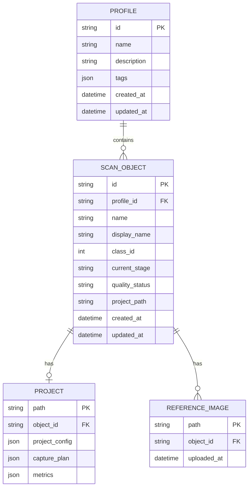
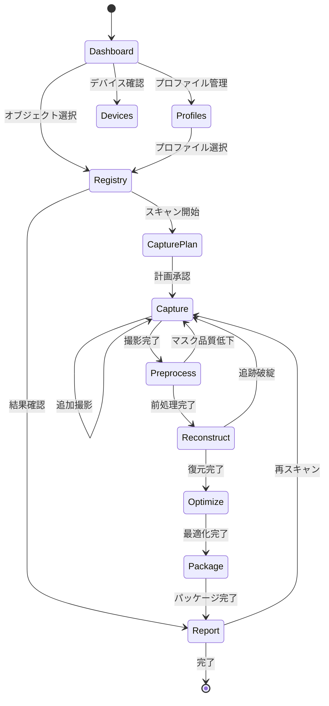
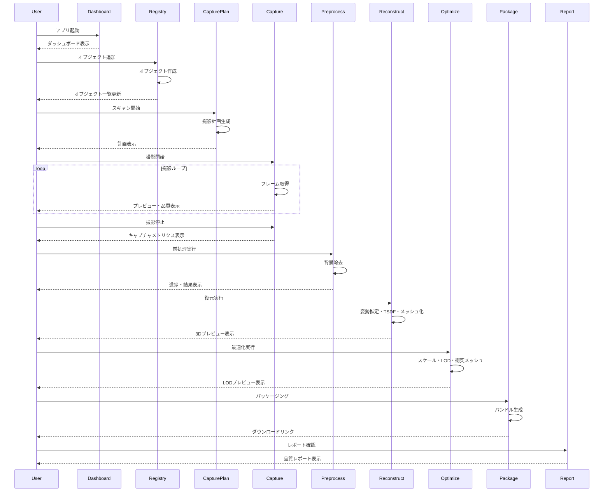
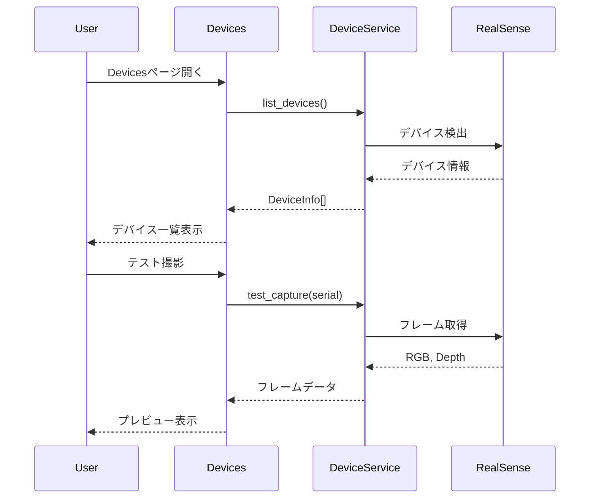

# 機能設計書 (Functional Design Document)

## システム構成図



## ページ構成図



## 技術スタック

| 分類 | 技術 | バージョン | 選定理由 |
|------|------|-----------|----------|
| 言語 | Python | 3.10+ | scan2mesh Coreとの統一、型ヒント充実 |
| GUIフレームワーク | Streamlit | 1.28+ | hsr-perception-robocupとの統一、高速プロトタイピング |
| 3Dビューア | streamlit-3d-viewer / pyvista | - | メッシュ・点群のインタラクティブ表示 |
| グラフ | Plotly | 5.0+ | インタラクティブなメトリクス可視化 |
| データモデル | Pydantic | 2.6+ | scan2mesh Coreとの統一、型安全な設定管理 |
| 状態管理 | streamlit session_state | - | Streamlit標準の状態管理 |
| コンテナ | Docker / Docker Compose | 24.0+ / 2.20+ | 環境の再現性 |

## データモデル定義

### プロファイル: Profile

```python
from pydantic import BaseModel, Field
from datetime import datetime
from typing import Optional
from enum import Enum

class Profile(BaseModel):
    """スキャンプロジェクトを管理するプロファイル"""
    id: str                          # UUID
    name: str = Field(..., min_length=1, max_length=100)  # プロファイル名
    description: Optional[str] = None  # 説明
    tags: list[str] = []             # タグ
    created_at: datetime             # 作成日時
    updated_at: datetime             # 更新日時

    class Config:
        json_schema_extra = {
            "example": {
                "id": "550e8400-e29b-41d4-a716-446655440000",
                "name": "RoboCup 2025 Objects",
                "description": "RoboCup 2025大会用の物体スキャン",
                "tags": ["robocup", "2025"],
                "created_at": "2026-01-06T10:00:00",
                "updated_at": "2026-01-06T10:00:00"
            }
        }
```

### スキャンオブジェクト: ScanObject

```python
class PipelineStage(str, Enum):
    """パイプラインステージ"""
    INIT = "init"
    PLAN = "plan"
    CAPTURE = "capture"
    PREPROCESS = "preprocess"
    RECONSTRUCT = "reconstruct"
    OPTIMIZE = "optimize"
    PACKAGE = "package"
    REPORT = "report"

class QualityStatus(str, Enum):
    """品質ステータス"""
    PASS = "pass"
    WARN = "warn"
    FAIL = "fail"
    PENDING = "pending"

class ScanObject(BaseModel):
    """スキャン対象オブジェクト"""
    id: str                          # UUID
    profile_id: str                  # 所属プロファイルID
    name: str = Field(..., min_length=1, max_length=100, pattern=r'^[a-zA-Z0-9_-]+$')
    display_name: str                # 表示名
    class_id: int = Field(..., ge=0, le=9999)
    tags: list[str] = []
    known_dimension_mm: Optional[float] = None  # 既知寸法（mm）
    dimension_type: Optional[str] = None  # "diameter", "length", etc.
    reference_images: list[str] = []  # 参照画像パス
    preview_image: Optional[str] = None  # プレビュー画像パス

    # パイプライン状態
    current_stage: PipelineStage = PipelineStage.INIT
    quality_status: QualityStatus = QualityStatus.PENDING
    project_path: Optional[str] = None  # scan2meshプロジェクトパス

    # タイムスタンプ
    created_at: datetime
    updated_at: datetime
    last_scan_at: Optional[datetime] = None
```

### デバイス情報: DeviceInfo

```python
class DeviceInfo(BaseModel):
    """RealSenseデバイス情報"""
    serial_number: str               # シリアル番号
    name: str                        # デバイス名 (e.g., "Intel RealSense D435")
    firmware_version: str            # ファームウェアバージョン
    usb_type: str                    # USB規格 (e.g., "3.2")
    is_connected: bool = True        # 接続状態

    # 対応解像度
    color_resolutions: list[tuple[int, int]] = []  # [(1920, 1080), ...]
    depth_resolutions: list[tuple[int, int]] = []  # [(1280, 720), ...]

    # 現在の設定
    current_color_resolution: Optional[tuple[int, int]] = None
    current_depth_resolution: Optional[tuple[int, int]] = None
    current_fps: int = 30
```

### アプリケーション設定: AppConfig

```python
class DefaultPreset(BaseModel):
    """デフォルト出力プリセット"""
    coordinate_system: str = "Z-up"
    units: str = "meter"
    texture_resolution: int = 2048
    lod_triangle_limits: list[int] = [100000, 30000, 10000]

class QualityThresholds(BaseModel):
    """品質ゲート閾値"""
    depth_valid_ratio_warn: float = 0.7
    depth_valid_ratio_fail: float = 0.5
    blur_score_warn: float = 0.6
    blur_score_fail: float = 0.4
    coverage_warn: float = 0.7
    coverage_fail: float = 0.5
    min_keyframes: int = 10

class AppConfig(BaseModel):
    """アプリケーション全体の設定"""
    profiles_dir: str = "profiles"
    projects_dir: str = "projects"
    output_dir: str = "output"
    log_level: str = "INFO"
    default_preset: DefaultPreset = DefaultPreset()
    quality_thresholds: QualityThresholds = QualityThresholds()
    language: str = "ja"  # "ja" or "en"
```

### ER図



## コンポーネント設計

### サービスレイヤー

#### ProfileService

```python
class ProfileService:
    """プロファイル管理サービス"""

    def __init__(self, profiles_dir: Path):
        self.profiles_dir = profiles_dir

    def list_profiles(self) -> list[Profile]:
        """全プロファイルを取得"""
        pass

    def get_profile(self, profile_id: str) -> Optional[Profile]:
        """プロファイルを取得"""
        pass

    def create_profile(self, name: str, description: str = "", tags: list[str] = []) -> Profile:
        """プロファイルを作成"""
        pass

    def update_profile(self, profile_id: str, **kwargs) -> Profile:
        """プロファイルを更新"""
        pass

    def delete_profile(self, profile_id: str) -> bool:
        """プロファイルを削除"""
        pass

    def export_profile(self, profile_id: str, output_path: Path) -> Path:
        """プロファイルをエクスポート"""
        pass

    def import_profile(self, file_path: Path) -> Profile:
        """プロファイルをインポート"""
        pass
```

#### ObjectService

```python
class ObjectService:
    """スキャンオブジェクト管理サービス"""

    def __init__(self, profiles_dir: Path, projects_dir: Path):
        self.profiles_dir = profiles_dir
        self.projects_dir = projects_dir

    def list_objects(self, profile_id: str,
                     filter_stage: Optional[PipelineStage] = None,
                     filter_status: Optional[QualityStatus] = None) -> list[ScanObject]:
        """オブジェクト一覧を取得"""
        pass

    def get_object(self, object_id: str) -> Optional[ScanObject]:
        """オブジェクトを取得"""
        pass

    def create_object(self, profile_id: str, name: str, class_id: int, **kwargs) -> ScanObject:
        """オブジェクトを作成"""
        pass

    def update_object(self, object_id: str, **kwargs) -> ScanObject:
        """オブジェクトを更新"""
        pass

    def delete_object(self, object_id: str) -> bool:
        """オブジェクトを削除"""
        pass

    def add_reference_image(self, object_id: str, image_path: Path) -> str:
        """参照画像を追加"""
        pass

    def get_scan_history(self, object_id: str) -> list[dict]:
        """スキャン履歴を取得"""
        pass
```

#### DeviceService

```python
class DeviceService:
    """RealSenseデバイス管理サービス"""

    def list_devices(self) -> list[DeviceInfo]:
        """接続されているデバイス一覧を取得"""
        pass

    def get_device(self, serial_number: str) -> Optional[DeviceInfo]:
        """デバイス情報を取得"""
        pass

    def test_capture(self, serial_number: str) -> tuple[np.ndarray, np.ndarray]:
        """テスト撮影（RGB, Depth）"""
        pass

    def set_resolution(self, serial_number: str,
                       color_resolution: tuple[int, int],
                       depth_resolution: tuple[int, int],
                       fps: int) -> bool:
        """解像度を設定"""
        pass

    def is_connected(self, serial_number: str) -> bool:
        """接続状態を確認"""
        pass
```

#### PipelineService

```python
class PipelineService:
    """パイプライン実行サービス（scan2mesh Coreのラッパー）"""

    def __init__(self, projects_dir: Path):
        self.projects_dir = projects_dir

    def init_project(self, object: ScanObject) -> Path:
        """プロジェクトを初期化"""
        pass

    def generate_plan(self, project_path: Path, preset: str = "standard") -> dict:
        """撮影計画を生成"""
        pass

    def start_capture(self, project_path: Path,
                      on_frame: Callable[[FrameData], None],
                      on_quality: Callable[[dict], None]) -> None:
        """撮影を開始（コールバック付き）"""
        pass

    def stop_capture(self, project_path: Path) -> dict:
        """撮影を停止し、メトリクスを返す"""
        pass

    def run_preprocess(self, project_path: Path,
                       method: str,
                       on_progress: Callable[[float], None]) -> dict:
        """前処理を実行"""
        pass

    def run_reconstruct(self, project_path: Path,
                        on_progress: Callable[[float, str], None]) -> dict:
        """3D復元を実行"""
        pass

    def run_optimize(self, project_path: Path,
                     options: dict,
                     on_progress: Callable[[float], None]) -> dict:
        """最適化を実行"""
        pass

    def run_package(self, project_path: Path,
                    output_path: Path,
                    as_zip: bool = False) -> Path:
        """パッケージングを実行"""
        pass

    def get_metrics(self, project_path: Path) -> dict:
        """全メトリクスを取得"""
        pass

    def get_quality_status(self, project_path: Path) -> tuple[QualityStatus, list[str]]:
        """品質ステータスと理由を取得"""
        pass
```

### UIコンポーネント

#### 共通コンポーネント

```python
# components/sidebar.py
def render_sidebar():
    """サイドバーを描画"""
    with st.sidebar:
        render_profile_selector()
        render_navigation()
        render_system_status()

def render_profile_selector():
    """プロファイル選択UIを描画"""
    pass

def render_navigation():
    """ナビゲーションメニューを描画"""
    pass

def render_system_status():
    """システム状態（RealSense接続、GPU利用可否）を描画"""
    pass
```

```python
# components/metrics_display.py
def render_quality_badge(status: QualityStatus):
    """品質バッジ（PASS/WARN/FAIL）を描画"""
    colors = {
        QualityStatus.PASS: "green",
        QualityStatus.WARN: "orange",
        QualityStatus.FAIL: "red",
        QualityStatus.PENDING: "gray"
    }
    st.markdown(f'<span style="color: {colors[status]}">{status.value.upper()}</span>',
                unsafe_allow_html=True)

def render_metrics_table(metrics: dict, thresholds: dict):
    """メトリクステーブルを描画"""
    pass

def render_progress_bar(progress: float, label: str):
    """進捗バーを描画"""
    pass
```

```python
# components/viewer_3d.py
def render_mesh_viewer(mesh_path: Path, height: int = 400):
    """3Dメッシュビューアを描画"""
    pass

def render_pointcloud_viewer(ply_path: Path, height: int = 400):
    """点群ビューアを描画"""
    pass

def render_lod_comparison(lod_paths: list[Path]):
    """LOD比較ビューアを描画"""
    pass
```

```python
# components/camera_preview.py
def render_camera_preview(rgb_frame: np.ndarray, depth_frame: np.ndarray):
    """カメラプレビュー（RGB/Depth並列表示）を描画"""
    col1, col2 = st.columns(2)
    with col1:
        st.image(rgb_frame, caption="RGB", channels="BGR")
    with col2:
        st.image(colorize_depth(depth_frame), caption="Depth")

def render_quality_overlay(frame: np.ndarray, quality: FrameQuality):
    """品質オーバーレイ付きフレームを描画"""
    pass
```

## 画面遷移図



## ユースケース図

### ユースケース1: 新規オブジェクトのスキャン



### ユースケース2: デバイス接続確認



## UI設計

### ページレイアウト

#### Dashboard

```
┌─────────────────────────────────────────────────────────────────────────┐
│ [Logo] scan2mesh GUI                    [プロファイル: RoboCup 2025 ▼]   │
├─────────────┬───────────────────────────────────────────────────────────┤
│             │                                                           │
│  Dashboard  │  ┌─────────────┐ ┌─────────────┐ ┌─────────────┐         │
│  Profiles   │  │ Objects: 12 │ │ PASS: 8     │ │ In Progress:│         │
│  Registry   │  │             │ │ WARN: 3     │ │ 2           │         │
│  Devices    │  │             │ │ FAIL: 1     │ │             │         │
│  ─────────  │  └─────────────┘ └─────────────┘ └─────────────┘         │
│  Capture    │                                                           │
│  Plan       │  Recent Scans                                             │
│  Preprocess │  ┌────────────────────────────────────────────────────┐  │
│  Reconstruct│  │ Object      │ Stage       │ Status │ Date          │  │
│  Optimize   │  ├─────────────┼─────────────┼────────┼───────────────┤  │
│  Package    │  │ ball_01     │ Package     │ PASS   │ 2026-01-06    │  │
│  Report     │  │ bottle_02   │ Reconstruct │ WARN   │ 2026-01-06    │  │
│  ─────────  │  │ cup_03      │ Capture     │ -      │ 2026-01-05    │  │
│  Settings   │  └────────────────────────────────────────────────────┘  │
│             │                                                           │
│  ─────────  │  System Status                                            │
│  RealSense  │  ┌────────────────────────────────────────────────────┐  │
│  ● Connected│  │ RealSense: D435 (Connected)                        │  │
│  GPU        │  │ GPU: NVIDIA RTX 3080 (Available)                   │  │
│  ● Available│  │ Disk: 45GB free                                    │  │
│             │  └────────────────────────────────────────────────────┘  │
└─────────────┴───────────────────────────────────────────────────────────┘
```

#### Capture

```
┌─────────────────────────────────────────────────────────────────────────┐
│ [Logo] scan2mesh GUI                    [プロファイル: RoboCup 2025 ▼]   │
├─────────────┬───────────────────────────────────────────────────────────┤
│             │  Capture: ball_01                                         │
│  Dashboard  │                                                           │
│  Profiles   │  ┌───────────────────────┐ ┌───────────────────────┐     │
│  Registry   │  │                       │ │                       │     │
│  Devices    │  │      RGB Preview      │ │     Depth Preview     │     │
│  ─────────  │  │                       │ │                       │     │
│  Capture ●  │  │                       │ │                       │     │
│  Plan       │  └───────────────────────┘ └───────────────────────┘     │
│  Preprocess │                                                           │
│  Reconstruct│  Quality Metrics (Real-time)                              │
│  Optimize   │  ┌────────────────────────────────────────────────────┐  │
│  Package    │  │ Depth Valid: ████████░░ 82%     Blur: ████████░░ 78%│  │
│  Report     │  │ Coverage:    ██████░░░░ 65%     Frames: 45 / 36    │  │
│  ─────────  │  └────────────────────────────────────────────────────┘  │
│  Settings   │                                                           │
│             │  Coverage Map                                             │
│             │  ┌────────────────────────────────────────────────────┐  │
│             │  │              [Spherical Coverage Map]               │  │
│             │  │                    Top: 40%                         │  │
│             │  │              Side: 80%   Side: 75%                  │  │
│             │  │                   Bottom: 20%                       │  │
│             │  └────────────────────────────────────────────────────┘  │
│             │                                                           │
│             │  [▶ Start Capture]  [■ Stop]  [↺ Reset]                  │
└─────────────┴───────────────────────────────────────────────────────────┘
```

#### Report

```
┌─────────────────────────────────────────────────────────────────────────┐
│ [Logo] scan2mesh GUI                    [プロファイル: RoboCup 2025 ▼]   │
├─────────────┬───────────────────────────────────────────────────────────┤
│             │  Quality Report: ball_01                                  │
│  Dashboard  │                                                           │
│  ...        │  ┌────────────────────────────────────────────────────┐  │
│             │  │                     ✓ PASS                          │  │
│  Report ●   │  │         Asset is ready for distribution             │  │
│             │  └────────────────────────────────────────────────────┘  │
│             │                                                           │
│             │  Capture Metrics                                          │
│             │  ┌──────────────────────┬───────────┬─────────────────┐  │
│             │  │ Metric               │ Value     │ Status          │  │
│             │  ├──────────────────────┼───────────┼─────────────────┤  │
│             │  │ Keyframes            │ 28        │ ✓               │  │
│             │  │ Depth Valid Ratio    │ 0.85      │ ✓               │  │
│             │  │ Blur Score           │ 0.78      │ ✓               │  │
│             │  │ Coverage             │ 0.92      │ ✓               │  │
│             │  └──────────────────────┴───────────┴─────────────────┘  │
│             │                                                           │
│             │  Asset Metrics                                            │
│             │  ┌──────────────────────┬───────────┬─────────────────┐  │
│             │  │ LOD0 Triangles       │ 45,230    │ ✓               │  │
│             │  │ Hole Area Ratio      │ 2.1%      │ ✓               │  │
│             │  │ Non-manifold Edges   │ 0         │ ✓               │  │
│             │  └──────────────────────┴───────────┴─────────────────┘  │
│             │                                                           │
│             │  [📄 Export PDF]  [📝 Export Markdown]  [↺ Re-scan]      │
└─────────────┴───────────────────────────────────────────────────────────┘
```

### カラーコーディング

| 要素 | 色 | Hex | 用途 |
|------|-----|-----|------|
| PASS | 緑 | #28a745 | 品質ゲート通過 |
| WARN | 黄/オレンジ | #ffc107 | 警告（使用可能だが注意） |
| FAIL | 赤 | #dc3545 | 失敗（再撮影/修正が必要） |
| PENDING | グレー | #6c757d | 未評価 |
| Connected | 緑 | #28a745 | デバイス接続中 |
| Disconnected | 赤 | #dc3545 | デバイス未接続 |
| In Progress | 青 | #007bff | 処理中 |

### アイコン

| アイコン | 用途 |
|---------|------|
| ✓ | 成功・OK |
| ⚠ | 警告 |
| ✗ | エラー・NG |
| ● | 接続中・アクティブ |
| ○ | 未接続・非アクティブ |
| ▶ | 開始 |
| ■ | 停止 |
| ↺ | リセット・再実行 |
| 📄 | ドキュメント |
| 📝 | 編集 |
| 🗑 | 削除 |
| ⬇ | ダウンロード |
| ⬆ | アップロード |

## ファイル構造

### データ保存構造

```
scan2mesh-gui/
├── profiles/                    # プロファイルデータ
│   ├── {profile_id}/
│   │   ├── profile.json         # プロファイル設定
│   │   └── objects/
│   │       ├── {object_id}/
│   │       │   ├── object.json  # オブジェクト設定
│   │       │   └── reference/   # 参照画像
│   │       │       ├── ref_001.png
│   │       │       └── ref_002.png
│   │       └── ...
│   └── ...
│
├── projects/                    # scan2meshプロジェクト
│   ├── {object_id}/             # オブジェクトIDに対応
│   │   ├── project.json
│   │   ├── capture_plan.json
│   │   ├── raw_frames/
│   │   ├── masked_frames/
│   │   ├── recon/
│   │   ├── asset/
│   │   └── metrics/
│   └── ...
│
├── output/                      # 出力バンドル
│   └── {object_name}_{timestamp}.zip
│
├── config/                      # アプリケーション設定
│   └── app_config.json
│
└── logs/                        # ログ
    └── scan2mesh_gui.log
```

### profile.json

```json
{
  "id": "550e8400-e29b-41d4-a716-446655440000",
  "name": "RoboCup 2025 Objects",
  "description": "RoboCup 2025大会用の物体スキャン",
  "tags": ["robocup", "2025"],
  "created_at": "2026-01-06T10:00:00",
  "updated_at": "2026-01-06T10:00:00"
}
```

### object.json

```json
{
  "id": "660e8400-e29b-41d4-a716-446655440001",
  "profile_id": "550e8400-e29b-41d4-a716-446655440000",
  "name": "ball_01",
  "display_name": "サッカーボール",
  "class_id": 0,
  "tags": ["ball", "round"],
  "known_dimension_mm": 220,
  "dimension_type": "diameter",
  "reference_images": ["reference/ref_001.png"],
  "preview_image": null,
  "current_stage": "init",
  "quality_status": "pending",
  "project_path": "projects/660e8400-e29b-41d4-a716-446655440001",
  "created_at": "2026-01-06T10:00:00",
  "updated_at": "2026-01-06T10:00:00",
  "last_scan_at": null
}
```

## エラーハンドリング

### エラーの分類と対処

| エラー種別 | 処理 | ユーザーへの表示 |
|-----------|------|-----------------|
| RealSense未接続 | 接続待機、リトライ提案 | "RealSenseカメラが見つかりません。接続を確認してください。" |
| カメラストリームエラー | ストリーム再初期化 | "カメラストリームの取得に失敗しました。[再試行] をクリックしてください。" |
| プロファイル未選択 | ページ遷移ブロック | "プロファイルを選択してください。" |
| オブジェクト未選択 | ページ遷移ブロック | "オブジェクトを選択してください。" |
| 品質ゲートFAIL | 詳細表示、再撮影提案 | "品質基準を満たしていません。[詳細を確認] [再撮影]" |
| ディスク容量不足 | 処理停止、空き容量表示 | "ディスク容量が不足しています（必要: 2GB, 空き: 500MB）" |
| GPU利用不可 | CPUフォールバック警告 | "GPUが利用できません。CPU処理で続行します（処理時間が長くなります）。" |
| 処理タイムアウト | タイムアウト表示、リトライ | "処理がタイムアウトしました。[再試行]" |

### エラー表示コンポーネント

```python
def show_error(message: str, details: str = None, actions: list[tuple[str, Callable]] = None):
    """エラーメッセージを表示"""
    st.error(message)
    if details:
        with st.expander("詳細"):
            st.text(details)
    if actions:
        cols = st.columns(len(actions))
        for i, (label, callback) in enumerate(actions):
            if cols[i].button(label):
                callback()

def show_warning(message: str, dismiss: bool = True):
    """警告メッセージを表示"""
    st.warning(message)

def show_success(message: str):
    """成功メッセージを表示"""
    st.success(message)
```

## テスト戦略

### ユニットテスト

- **サービスレイヤー**:
  - ProfileService: CRUD操作、エクスポート/インポート
  - ObjectService: CRUD操作、フィルタリング
  - DeviceService: デバイス検出（モック使用）
  - PipelineService: 各ステージの実行（モック使用）

- **データモデル**:
  - Pydanticモデルのバリデーション
  - シリアライズ/デシリアライズ

### 統合テスト

- **ページ遷移**: 各ページ間の遷移が正常に動作するか
- **状態管理**: session_stateの整合性
- **サービス連携**: GUI→Service→Coreの連携

### E2Eテスト（chrome-devtools-mcp使用）

- **基本フロー**: プロファイル作成→オブジェクト追加→設定確認
- **撮影フロー**: モックデバイスでの撮影シミュレーション
- **エラー表示**: 各種エラー条件でのUI表示確認
- **レスポンシブ**: 異なる画面サイズでの表示確認

### テスト環境

| 環境 | 用途 | 備考 |
|------|------|------|
| ローカル | 開発時テスト | モックデバイス使用 |
| Docker (CPU) | CI/CD | GPU非依存テスト |
| Docker (GPU) | 統合テスト | 実デバイステスト |
