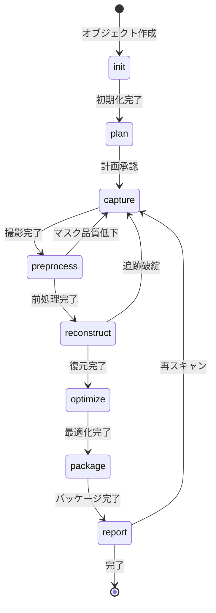

# 用語集 (Glossary)

## 概要

このドキュメントは、scan2mesh GUIプロジェクト内で使用される用語の定義を管理します。

**更新日**: 2026-01-06

---

## ドメイン用語

プロジェクト固有のビジネス概念や機能に関する用語。

### プロファイル (Profile)

**定義**: 複数のスキャンオブジェクトをグループ化して管理するための単位

**説明**:
プロファイルは、特定の目的（例: RoboCup 2025大会用物体）に関連するスキャンオブジェクトをまとめて管理するためのコンテナです。名前、説明、タグを持ち、エクスポート・インポートが可能です。

**関連用語**:
- [スキャンオブジェクト](#スキャンオブジェクト-scanobject)
- [オブジェクトレジストリ](#オブジェクトレジストリ-registry)

**使用例**:
- 「RoboCup 2025用のプロファイルを作成する」
- 「プロファイルをエクスポートしてチームメンバーと共有する」

**データモデル**: `app/models/profile.py`

**英語表記**: Profile

---

### スキャンオブジェクト (ScanObject)

**定義**: 3Dスキャンの対象となる個別の物体

**説明**:
スキャンオブジェクトは、特定のプロファイルに属し、名前、クラスID、既知寸法、参照画像などの属性を持ちます。各オブジェクトは8ステージのパイプラインを通じて3Dモデルに変換されます。

**関連用語**:
- [プロファイル](#プロファイル-profile)
- [パイプライン](#パイプライン-pipeline)
- [品質ステータス](#品質ステータス-quality-status)

**使用例**:
- 「新しいスキャンオブジェクトを登録する」
- 「オブジェクトのスキャンを開始する」

**データモデル**: `app/models/scan_object.py`

**英語表記**: ScanObject

---

### パイプライン (Pipeline)

**定義**: scan2meshの8ステージからなる3Dモデル生成処理フロー

**説明**:
パイプラインは、Init → Plan → Capture → Preprocess → Reconstruct → Optimize → Package → Report の8ステージで構成されます。各ステージには品質ゲートがあり、品質基準を満たさない場合は警告または失敗となります。

**関連用語**:
- [パイプラインステージ](#パイプラインステージ-pipeline-stage)
- [品質ゲート](#品質ゲート-quality-gate)

**8ステージ概要**:

| ステージ | 説明 |
|---------|------|
| Init | プロジェクト初期化 |
| Plan | 撮影計画生成 |
| Capture | RGBDデータ撮影 |
| Preprocess | 背景除去・マスク生成 |
| Reconstruct | 3D復元（点群・メッシュ） |
| Optimize | メッシュ最適化・LOD生成 |
| Package | アセットバンドル生成 |
| Report | 品質レポート生成 |

**英語表記**: Pipeline

---

### パイプラインステージ (Pipeline Stage)

**定義**: パイプラインを構成する個別の処理段階

**取りうる値**:

| ステージ | 日本語名 | 説明 |
|---------|---------|------|
| `init` | 初期化 | プロジェクトディレクトリ作成、設定ファイル生成 |
| `plan` | 撮影計画 | 撮影視点・角度の計画生成 |
| `capture` | 撮影 | RealSenseによるRGBDデータ取得 |
| `preprocess` | 前処理 | 背景除去、マスク生成、ノイズ除去 |
| `reconstruct` | 3D復元 | 姿勢推定、TSDF統合、メッシュ抽出 |
| `optimize` | 最適化 | スケール正規化、LOD生成、衝突メッシュ生成 |
| `package` | パッケージング | アセットバンドル、マニフェスト生成 |
| `report` | レポート | 品質レポート、メトリクス集計 |

**状態遷移図**:


**英語表記**: Pipeline Stage

---

### 品質ゲート (Quality Gate)

**定義**: 各パイプラインステージで品質基準を満たしているか判定する仕組み

**説明**:
品質ゲートは、撮影品質、復元品質、アセット品質などを数値で評価し、閾値と比較してPASS/WARN/FAILを判定します。閾値はアプリケーション設定でカスタマイズ可能です。

**関連用語**:
- [品質ステータス](#品質ステータス-quality-status)
- [パイプラインステージ](#パイプラインステージ-pipeline-stage)

**主な評価指標**:

| 指標 | 説明 | WARN閾値 | FAIL閾値 |
|------|------|---------|---------|
| Depth Valid Ratio | 有効な深度データの割合 | < 0.7 | < 0.5 |
| Blur Score | ブレの少なさ | < 0.6 | < 0.4 |
| Coverage | スキャン範囲のカバー率 | < 0.7 | < 0.5 |
| Min Keyframes | 最小キーフレーム数 | - | < 10 |

**英語表記**: Quality Gate

---

### 品質ステータス (Quality Status)

**定義**: スキャンオブジェクトの品質判定結果を示す状態値

**取りうる値**:

| ステータス | 意味 | 色 | アクション |
|----------|------|-----|-----------|
| `pass` | 合格 | 緑 (#28a745) | 次のステージへ進行可能 |
| `warn` | 警告 | 黄 (#ffc107) | 進行可能だが注意が必要 |
| `fail` | 失敗 | 赤 (#dc3545) | 再撮影または修正が必要 |
| `pending` | 未評価 | グレー (#6c757d) | 評価待ち |

**実装**:
```python
class QualityStatus(str, Enum):
    PASS = "pass"
    WARN = "warn"
    FAIL = "fail"
    PENDING = "pending"
```

**英語表記**: Quality Status

---

### オブジェクトレジストリ (Registry)

**定義**: スキャンオブジェクトを一覧表示・管理するページ

**説明**:
オブジェクトレジストリは、選択されたプロファイル内のスキャンオブジェクトを一覧表示し、追加・編集・削除・フィルタリング機能を提供します。hsr-perception-robocupの同名機能と同様のUI/UXを持ちます。

**関連用語**:
- [スキャンオブジェクト](#スキャンオブジェクト-scanobject)
- [プロファイル](#プロファイル-profile)

**英語表記**: Registry

---

### 撮影計画 (Capture Plan)

**定義**: スキャン時の撮影視点、角度、距離などを定義した計画

**説明**:
撮影計画は、プリセット（Quick/Standard/Hard）またはカスタム設定に基づいて生成されます。計画には視点数、各視点の球面座標、推奨距離などが含まれます。

**プリセット**:

| プリセット | 視点数 | 用途 |
|-----------|--------|------|
| Quick | 16 | 簡易スキャン、テスト用 |
| Standard | 36 | 通常のスキャン |
| Hard | 64 | 高精度スキャン、複雑な形状用 |

**英語表記**: Capture Plan

---

### キーフレーム (Keyframe)

**定義**: 3D復元に使用される重要なフレーム

**説明**:
キーフレームは、撮影されたフレームの中から品質基準を満たし、かつ十分な視点変化があるフレームとして選択されたものです。キーフレーム数が少ないと復元品質が低下します。

**関連用語**:
- [撮影](#撮影-capture)
- [品質ゲート](#品質ゲート-quality-gate)

**英語表記**: Keyframe

---

### カバレッジ (Coverage)

**定義**: スキャン対象物体の表面がどの程度撮影されたかを示す割合

**説明**:
カバレッジは0.0〜1.0の値で、1.0に近いほど物体の全方向からの撮影が完了していることを示します。品質ゲートの重要な指標の一つです。

**関連用語**:
- [撮影計画](#撮影計画-capture-plan)
- [品質ゲート](#品質ゲート-quality-gate)

**英語表記**: Coverage

---

## 技術用語

プロジェクトで使用している技術・フレームワーク・ツールに関する用語。

### Streamlit

**定義**: Pythonで高速にWebアプリケーションを構築できるフレームワーク

**公式サイト**: https://streamlit.io/

**本プロジェクトでの用途**:
scan2mesh GUIのメインフレームワークとして使用。ページ描画、ユーザー入力、状態管理を担当。

**バージョン**: 1.28+

**選定理由**:
- hsr-perception-robocupとの統一されたUI/UX
- Pythonのみで高速にWebUI構築可能
- リアルタイム更新対応
- 豊富なコンポーネント

**関連ドキュメント**:
- [アーキテクチャ設計書](./architecture.md#テクノロジースタック)
- [機能設計書](./functional-design.md#技術スタック)

---

### Pydantic

**定義**: Pythonのデータバリデーションとシリアライゼーションライブラリ

**公式サイト**: https://docs.pydantic.dev/

**本プロジェクトでの用途**:
データモデル定義（Profile, ScanObject, DeviceInfo, AppConfig）、設定ファイルの型安全な読み書き、入力検証。

**バージョン**: 2.6+

**選定理由**:
- scan2mesh Coreとの統一
- 型安全な設定管理
- JSONシリアライズが容易

**関連ドキュメント**:
- [機能設計書](./functional-design.md#データモデル定義)

---

### PyVista

**定義**: VTKをベースにしたPythonの3D可視化ライブラリ

**公式サイト**: https://docs.pyvista.org/

**本プロジェクトでの用途**:
メッシュ・点群のインタラクティブ3D表示。stpyvistaを通じてStreamlitに統合。

**バージョン**: 0.42+

**選定理由**:
- 高性能な3Dレンダリング
- VTKの豊富な機能をPython的なAPIで利用可能
- Streamlitとの連携が可能

---

### RealSense

**定義**: Intel社製のRGB-D（カラー＋深度）カメラシリーズ

**公式サイト**: https://www.intelrealsense.com/

**本プロジェクトでの用途**:
3Dスキャン用のRGBDデータ取得。D400シリーズ（D415, D435, D455）に対応。

**対応モデル**:

| モデル | 特徴 | 推奨用途 |
|--------|------|---------|
| D415 | 狭視野、高精度 | 小物体の精密スキャン |
| D435 | 広視野、バランス良好 | 一般的なスキャン（推奨） |
| D455 | 長距離、IMU内蔵 | 大型物体、動作補正 |

**関連ライブラリ**: pyrealsense2 2.55+

---

### Open3D

**定義**: 3Dデータ処理のためのオープンソースライブラリ

**公式サイト**: http://www.open3d.org/

**本プロジェクトでの用途**:
点群処理、TSDF統合、メッシュ再構成、姿勢推定。scan2mesh Coreと共有。

**バージョン**: 0.18+

**選定理由**:
- CPU/GPU両対応
- 豊富な3D処理機能
- Pythonバインディングが充実

---

### Docker

**定義**: コンテナ仮想化プラットフォーム

**公式サイト**: https://www.docker.com/

**本プロジェクトでの用途**:
scan2mesh GUIの実行環境をコンテナ化。CPU版とGPU版の2つのイメージを提供。

**バージョン**: 24.0+

**選定理由**:
- 環境の再現性
- 依存関係の隔離
- チーム間での共有が容易

**イメージ構成**:
- `scan2mesh-gui:cpu` - CPU環境用（python:3.10-slim ベース）
- `scan2mesh-gui:gpu` - GPU環境用（nvidia/cuda:12.2-runtime-ubuntu22.04 ベース）

---

### uv

**定義**: Rust製の高速Pythonパッケージマネージャー

**公式サイト**: https://docs.astral.sh/uv/

**本プロジェクトでの用途**:
依存関係の管理、仮想環境の作成、パッケージのインストール。

**バージョン**: 0.4+

**選定理由**:
- scan2mesh Coreとの統一
- pip/poetry比で10-100倍高速な依存解決
- ロックファイル（uv.lock）による再現性

---

## 略語・頭字語

### GUI

**正式名称**: Graphical User Interface

**意味**: グラフィカルユーザーインターフェース

**本プロジェクトでの使用**:
scan2mesh GUIは、scan2mesh CLIをGUIから操作可能にするStreamlitベースのWebアプリケーション。

---

### CLI

**正式名称**: Command Line Interface

**意味**: コマンドラインインターフェース

**本プロジェクトでの使用**:
scan2mesh Coreが提供するコマンドラインツール。GUIはCLIを補完するものであり、CLIは引き続き利用可能。

---

### RGBD

**正式名称**: RGB + Depth

**意味**: カラー画像（RGB）と深度画像（Depth）の組み合わせ

**本プロジェクトでの使用**:
RealSenseカメラから取得するデータ形式。RGBは3チャンネルカラー、Depthは距離情報を含む。

---

### LOD

**正式名称**: Level of Detail

**意味**: 詳細度レベル

**本プロジェクトでの使用**:
最適化ステージで生成される異なる詳細度のメッシュ。遠距離表示や軽量表示に使用。

| LOD | 三角形数上限 | 用途 |
|-----|------------|------|
| LOD0 | 100,000 | 高詳細表示 |
| LOD1 | 30,000 | 中距離表示 |
| LOD2 | 10,000 | 遠距離表示・サムネイル |

---

### TSDF

**正式名称**: Truncated Signed Distance Function

**意味**: 切断符号付き距離関数

**本プロジェクトでの使用**:
3D復元ステージで使用されるボリューム表現。複数フレームの深度データを統合して3Dモデルを生成する際の中間表現。

**処理フロー**:
1. 各フレームの深度データをTSDFボリュームに統合
2. TSDFからマーチングキューブ法でメッシュを抽出

---

### CUDA

**正式名称**: Compute Unified Device Architecture

**意味**: NVIDIA社のGPU汎用計算プラットフォーム

**本プロジェクトでの使用**:
Open3DのGPU高速化に使用。オプションであり、CPU環境でも動作可能（処理速度は低下）。

**バージョン**: 12.2（オプション）

---

### E2E

**正式名称**: End to End

**意味**: エンドツーエンド（端から端まで）

**本プロジェクトでの使用**:
E2Eテストは、chrome-devtools-mcpを使用してブラウザ上での操作フローをテストする。

---

### PRD

**正式名称**: Product Requirements Document

**意味**: プロダクト要求定義書

**本プロジェクトでの使用**:
`docs-gui/product-requirements.md`がscan2mesh GUIのPRD。

---

## アーキテクチャ用語

システム設計・アーキテクチャに関する用語。

### レイヤードアーキテクチャ (Layered Architecture)

**定義**: システムを役割ごとに複数の層に分割し、上位層から下位層への一方向の依存関係を持たせる設計パターン

**本プロジェクトでの適用**:
4層アーキテクチャを採用:

```
UI Layer (Streamlit)
    ↓
Service Layer
    ↓
Data Layer ←→ scan2mesh Core
    ↓           ↓
File System   External Devices
```

**各層の責務**:

| レイヤー | 責務 | 許可される操作 |
|---------|------|---------------|
| UI Layer | ページ描画、ユーザー入力、状態管理 | Service Layer呼び出し |
| Service Layer | ビジネスロジック、データ変換 | Data Layer・Core呼び出し |
| Data Layer | データ永続化、ファイルI/O | ファイルシステムアクセス |

**依存関係のルール**:
- UI Layer → Service Layer （許可）
- Service Layer → Data Layer （許可）
- Service Layer → scan2mesh Core （許可）
- Data Layer → Service Layer （禁止）
- UI Layer → Data Layer 直接 （禁止）

**関連ドキュメント**:
- [アーキテクチャ設計書](./architecture.md#レイヤードアーキテクチャ)

---

### Service Layer

**定義**: ビジネスロジックを担当するレイヤー

**本プロジェクトでの適用**:
4つのサービスクラスを提供:

| サービス | 責務 |
|---------|------|
| ProfileService | プロファイルのCRUD操作 |
| ObjectService | スキャンオブジェクトのCRUD操作 |
| DeviceService | RealSenseデバイスの検出・制御 |
| PipelineService | scan2mesh Coreとの連携 |

**実装箇所**: `app/services/`

---

### session_state

**定義**: Streamlitが提供するセッション間で状態を保持する仕組み

**本プロジェクトでの適用**:
現在選択中のプロファイル、オブジェクト、処理進捗などを保持。

**使用例**:
```python
# 現在のプロファイルを保存
st.session_state.current_profile_id = profile.id

# 現在のオブジェクトを取得
object_id = st.session_state.get("current_object_id")
```

---

## データモデル用語

データベース・データ構造に関する用語。

### Profile

**定義**: スキャンプロジェクトを管理するプロファイルのデータモデル

**主要フィールド**:
- `id`: UUID（プライマリキー）
- `name`: プロファイル名（1-100文字）
- `description`: 説明（オプション）
- `tags`: タグのリスト
- `created_at`: 作成日時
- `updated_at`: 更新日時

**関連エンティティ**: [ScanObject](#scanobject-1)（1:N）

**保存先**: `profiles/{profile_id}/profile.json`

---

### ScanObject

**定義**: スキャン対象オブジェクトのデータモデル

**主要フィールド**:
- `id`: UUID（プライマリキー）
- `profile_id`: 所属プロファイルID（外部キー）
- `name`: オブジェクト名（英数字、アンダースコア、ハイフンのみ）
- `display_name`: 表示名
- `class_id`: クラスID（0-9999）
- `current_stage`: 現在のパイプラインステージ
- `quality_status`: 品質ステータス
- `project_path`: scan2meshプロジェクトパス

**関連エンティティ**:
- [Profile](#profile-1)（N:1）
- Project（1:0..1）

**保存先**: `profiles/{profile_id}/objects/{object_id}/object.json`

---

### DeviceInfo

**定義**: RealSenseデバイス情報のデータモデル

**主要フィールド**:
- `serial_number`: シリアル番号（プライマリキー）
- `name`: デバイス名（例: "Intel RealSense D435"）
- `firmware_version`: ファームウェアバージョン
- `usb_type`: USB規格（例: "3.2"）
- `is_connected`: 接続状態
- `color_resolutions`: 対応カラー解像度のリスト
- `depth_resolutions`: 対応深度解像度のリスト

**保存**: メモリのみ（永続化なし）

---

### AppConfig

**定義**: アプリケーション全体の設定データモデル

**主要フィールド**:
- `profiles_dir`: プロファイル保存ディレクトリ
- `projects_dir`: プロジェクト保存ディレクトリ
- `output_dir`: 出力ディレクトリ
- `log_level`: ログレベル
- `default_preset`: デフォルト出力プリセット
- `quality_thresholds`: 品質ゲート閾値

**保存先**: `config/app_config.json`

---

## エラー・例外

システムで定義されているエラーと例外。

### Scan2MeshGUIError

**クラス名**: `Scan2MeshGUIError`

**継承元**: `Exception`

**発生条件**: GUI関連の基底エラー

**対処方法**:
- ユーザー: エラーメッセージを確認し、指示に従う
- 開発者: 派生クラスで具体的なエラーを定義

---

### DeviceError

**クラス名**: `DeviceError`

**継承元**: `Scan2MeshGUIError`

**発生条件**: RealSenseカメラの接続エラー、ストリームエラー

**エラーメッセージ例**:
- "RealSenseカメラが見つかりません。接続を確認してください。"
- "カメラストリームの取得に失敗しました。[再試行] をクリックしてください。"

**対処方法**:
- ユーザー: カメラのUSB接続を確認、再試行ボタンをクリック
- 開発者: pyrealsense2のエラーログを確認

---

### ProfileError

**クラス名**: `ProfileError`

**継承元**: `Scan2MeshGUIError`

**発生条件**: プロファイルの作成・読み込み・削除時のエラー

**対処方法**:
- ユーザー: プロファイル名の重複や不正な文字を確認
- 開発者: ファイルシステムのパーミッションを確認

---

### PipelineError

**クラス名**: `PipelineError`

**継承元**: `Scan2MeshGUIError`

**発生条件**: パイプライン実行中のエラー（品質ゲート失敗、処理タイムアウト等）

**対処方法**:
- ユーザー: 品質ゲートの詳細を確認、再撮影または設定調整
- 開発者: scan2mesh Coreのログを確認

---

## 索引

### あ行
- [アーキテクチャ設計書](#レイヤードアーキテクチャ-layered-architecture) - アーキテクチャ用語
- [オブジェクトレジストリ](#オブジェクトレジストリ-registry) - ドメイン用語

### か行
- [カバレッジ](#カバレッジ-coverage) - ドメイン用語
- [キーフレーム](#キーフレーム-keyframe) - ドメイン用語

### さ行
- [撮影計画](#撮影計画-capture-plan) - ドメイン用語
- [スキャンオブジェクト](#スキャンオブジェクト-scanobject) - ドメイン用語

### た行
- [データモデル](#データモデル用語) - データモデル用語

### は行
- [パイプライン](#パイプライン-pipeline) - ドメイン用語
- [パイプラインステージ](#パイプラインステージ-pipeline-stage) - ドメイン用語
- [品質ゲート](#品質ゲート-quality-gate) - ドメイン用語
- [品質ステータス](#品質ステータス-quality-status) - ドメイン用語
- [プロファイル](#プロファイル-profile) - ドメイン用語

### ら行
- [レイヤードアーキテクチャ](#レイヤードアーキテクチャ-layered-architecture) - アーキテクチャ用語

### A-Z
- [AppConfig](#appconfig) - データモデル用語
- [CLI](#cli) - 略語
- [CUDA](#cuda) - 略語
- [DeviceError](#deviceerror) - エラー・例外
- [DeviceInfo](#deviceinfo) - データモデル用語
- [Docker](#docker) - 技術用語
- [E2E](#e2e) - 略語
- [GUI](#gui) - 略語
- [LOD](#lod) - 略語
- [Open3D](#open3d) - 技術用語
- [PRD](#prd) - 略語
- [Profile](#profile-1) - データモデル用語
- [ProfileError](#profileerror) - エラー・例外
- [Pydantic](#pydantic) - 技術用語
- [PipelineError](#pipelineerror) - エラー・例外
- [PyVista](#pyvista) - 技術用語
- [RealSense](#realsense) - 技術用語
- [RGBD](#rgbd) - 略語
- [Scan2MeshGUIError](#scan2meshguierror) - エラー・例外
- [ScanObject](#scanobject-1) - データモデル用語
- [Service Layer](#service-layer) - アーキテクチャ用語
- [session_state](#session_state) - アーキテクチャ用語
- [Streamlit](#streamlit) - 技術用語
- [TSDF](#tsdf) - 略語
- [uv](#uv) - 技術用語
