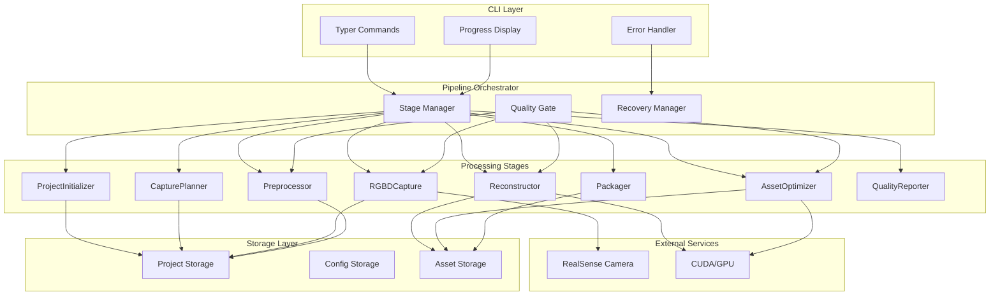

# 技術仕様書 (Architecture Design Document)

## テクノロジースタック

### 言語・ランタイム

| 技術 | バージョン | 選定理由 |
|------|-----------|----------|
| Python | 3.10+ | RealSense SDK、Open3D、科学計算ライブラリとの親和性が高い。型ヒントの充実したバージョン |
| CUDA | 12.2 | Open3DのGPU高速化に必要。Ubuntu 22.04/24.04で安定動作 |

### フレームワーク・ライブラリ

| 技術 | バージョン | 用途 | 選定理由 |
|------|-----------|------|----------|
| Typer | 0.12+ | CLIフレームワーク | Click上に構築された型ヒント対応CLI。自動ヘルプ生成、サブコマンド構造をサポート |
| pyrealsense2 | 2.55+ | RealSense制御 | Intel公式SDK。D400シリーズの全機能にアクセス可能 |
| Open3D | 0.18+ | 3D処理 | RGBD処理、TSDF、メッシュ操作を統合。CUDA対応で高速化 |
| trimesh | 4.4+ | メッシュ操作 | LOD生成、形式変換、検証。Open3Dを補完 |
| pymeshlab | 2023.12+ | メッシュ修正 | 非多様体修正、穴埋め、簡略化。MeshLabのPythonバインディング |
| OpenCV | 4.9+ | 画像処理 | ブラー検出、マスク生成、画像フィルタリング |
| NumPy | 1.26+ | 数値計算 | 行列演算、点群処理の基盤 |
| Pydantic | 2.6+ | 設定・データ検証 | 型安全な設定管理、JSONシリアライズ |
| rich | 13.7+ | CLI出力 | プログレスバー、テーブル、カラー出力 |
| pygltflib | 1.16+ | glTFエクスポート | glTF 2.0準拠の3Dモデル出力 |

### コンテナ・インフラ

| 技術 | バージョン | 用途 | 選定理由 |
|------|-----------|------|----------|
| Docker | 24.0+ | コンテナランタイム | 環境の再現性、異なるデバイス間での共有 |
| Docker Compose | 2.20+ | コンテナオーケストレーション | 複数サービスの定義、ボリューム・デバイス管理 |
| NVIDIA Container Toolkit | 1.14+ | GPU対応 | コンテナ内からNVIDIA GPUへアクセス |

### 開発ツール

| 技術 | バージョン | 用途 | 選定理由 |
|------|-----------|------|----------|
| uv | 0.4+ | パッケージ管理 | 高速な依存解決、ロックファイルによる再現性 |
| Ruff | 0.3+ | リンター・フォーマッター | 高速なPythonリンター、Black互換フォーマット |
| pytest | 8.0+ | テストフレームワーク | Pythonデファクトスタンダード、豊富なプラグイン |
| mypy | 1.9+ | 型チェック | 静的型検査による品質向上 |

## アーキテクチャパターン

### パイプラインアーキテクチャ

scan2meshは7ステージのパイプラインアーキテクチャを採用します。
各ステージは独立して実行可能で、中間結果はファイルシステムに永続化されます。

```
┌─────────────────────────────────────────────────────────────────────────┐
│                              CLI Layer                                   │
│  (コマンド解析、バリデーション、進捗表示、エラーハンドリング)                  │
└─────────────────────────────────────────────────────────────────────────┘
                                    │
                                    ▼
┌─────────────────────────────────────────────────────────────────────────┐
│                          Pipeline Orchestrator                           │
│  (ステージ間の遷移管理、品質ゲート判定、リカバリー制御)                       │
└─────────────────────────────────────────────────────────────────────────┘
                                    │
        ┌───────────────────────────┼───────────────────────────┐
        ▼                           ▼                           ▼
┌───────────────┐  ┌───────────────────────────────────┐  ┌───────────────┐
│ Project Init  │  │          Processing Stages         │  │    Report     │
│               │→ │ Plan → Capture → Preprocess →      │→ │               │
│ (設定初期化)   │  │ Reconstruct → Optimize → Package   │  │ (品質レポート) │
└───────────────┘  └───────────────────────────────────┘  └───────────────┘
        │                           │                           │
        └───────────────────────────┼───────────────────────────┘
                                    ▼
┌─────────────────────────────────────────────────────────────────────────┐
│                            Storage Layer                                 │
│  (プロジェクトディレクトリ、設定ファイル、中間データ、出力アセット)            │
└─────────────────────────────────────────────────────────────────────────┘
```

### レイヤー定義

#### CLI Layer

- **責務**: ユーザー入力の受付、バリデーション、結果の表示
- **許可される操作**: Pipeline Orchestratorの呼び出し
- **禁止される操作**: Storage Layerへの直接アクセス、処理ロジックの実装

```python
# CLI Layer の設計方針
class CLI:
    def __init__(self, orchestrator: PipelineOrchestrator):
        self.orchestrator = orchestrator

    def capture(self, plan: str) -> None:
        """CLIはオーケストレーターを呼び出すだけ"""
        try:
            result = self.orchestrator.run_capture(plan)
            self.display_result(result)
        except PipelineError as e:
            self.display_error(e)
```

#### Pipeline Orchestrator

- **責務**: ステージ間の遷移管理、品質ゲート判定、エラーリカバリー
- **許可される操作**: 各Stageの実行、品質ゲートの評価
- **禁止される操作**: 具体的な処理ロジックの実装

```python
# Orchestrator の設計方針
class PipelineOrchestrator:
    def run_capture(self, plan: str) -> CaptureResult:
        """ステージを実行し、品質ゲートを評価"""
        result = self.capture_stage.execute(plan)
        gate_status = self.quality_gate.evaluate(result.metrics)

        if gate_status == "fail":
            raise QualityGateError("Capture failed", result.metrics)

        return result
```

#### Processing Stages

- **責務**: 各処理ステージの具体的なロジック実装
- **許可される操作**: Storage Layerへのアクセス、外部ライブラリの利用
- **禁止される操作**: 他ステージの直接呼び出し、CLI操作

```python
# Stage の設計方針
class CaptureStage:
    def __init__(self, storage: StorageService, camera: CameraService):
        self.storage = storage
        self.camera = camera

    def execute(self, plan: CapturePlan) -> CaptureResult:
        """カメラからデータを取得し、ストレージに保存"""
        frames = []
        for viewpoint in plan.viewpoints:
            frame = self.camera.capture_frame()
            self.storage.save_frame(frame)
            frames.append(frame)

        return CaptureResult(frames=frames, metrics=self.calculate_metrics(frames))
```

#### Storage Layer

- **責務**: データの永続化、取得、ファイル管理
- **許可される操作**: ファイルシステムへのアクセス
- **禁止される操作**: ビジネスロジックの実装

```python
# Storage Layer の設計方針
class StorageService:
    def __init__(self, project_dir: Path):
        self.project_dir = project_dir

    def save_frame(self, frame: FrameData) -> None:
        """フレームデータを保存"""
        rgb_path = self.project_dir / "raw_frames" / f"frame_{frame.id:04d}_rgb.png"
        depth_path = self.project_dir / "raw_frames" / f"frame_{frame.id:04d}_depth.png"
        cv2.imwrite(str(rgb_path), frame.rgb)
        np.save(str(depth_path), frame.depth)
```

## コンポーネント図



## データ永続化戦略

### ストレージ方式

| データ種別 | ストレージ | フォーマット | 理由 |
|-----------|----------|-------------|------|
| プロジェクト設定 | JSONファイル | JSON | 人間可読、バージョン管理可能 |
| 撮影計画 | JSONファイル | JSON | 構造化データ、編集可能 |
| RGBフレーム | 画像ファイル | PNG | ロスレス圧縮、広い互換性 |
| Depthフレーム | バイナリファイル | NPY/PNG | 16bit深度データの精度保持 |
| 点群 | PLYファイル | PLY | 標準形式、多くのツールで読み込み可能 |
| メッシュ | glTFファイル | GLB | 業界標準、テクスチャ内包、圧縮効率 |
| 衝突メッシュ | OBJファイル | OBJ | シンプル、広い互換性 |
| メトリクス | JSONファイル | JSON | 構造化、集計・分析が容易 |

### ファイルシステム構造

```
project_name/
├── project.json              # プロジェクト設定（ProjectConfig）
├── capture_plan.json         # 撮影計画（CapturePlan）
├── raw_frames/               # 生フレームデータ
│   ├── frame_0000_rgb.png    # RGB画像（1920x1080、PNG）
│   ├── frame_0000_depth.npy  # Depth（1280x720、uint16、mm単位）
│   └── frames_metadata.json  # フレームメタデータ一覧
├── keyframes/                # キーフレーム（選別後のコピー）
├── masked_frames/            # マスク適用済みフレーム
├── recon/                    # 復元結果
│   ├── pointcloud.ply        # 統合点群
│   ├── mesh_raw.glb          # 生メッシュ
│   └── recon_report.json     # 復元レポート
├── asset/                    # 最適化済みアセット
│   ├── visual_lod0.glb       # LOD0（高詳細）
│   ├── visual_lod1.glb       # LOD1（中詳細）
│   ├── visual_lod2.glb       # LOD2（低詳細）
│   ├── collision.obj         # 衝突メッシュ
│   ├── preview.png           # プレビュー画像
│   └── asset_metrics.json    # アセットメトリクス
├── metrics/                  # 各種メトリクス
│   ├── capture_metrics.json
│   └── mask_quality.json
└── logs/                     # ログファイル
    └── scan2mesh.log
```

### データ整合性

- **アトミック書き込み**: 一時ファイルに書き込み後、リネームで置換
- **チェックサム**: 大きなファイルにはSHA256チェックサムを付与
- **設定ハッシュ**: すべての出力に`config_hash`を記録し、再現性を保証

```python
# アトミック書き込みの例
def save_json_atomic(path: Path, data: dict) -> None:
    temp_path = path.with_suffix('.tmp')
    with open(temp_path, 'w') as f:
        json.dump(data, f, indent=2)
    temp_path.rename(path)  # アトミックな置換
```

## パフォーマンス要件

### レスポンスタイム

| 操作 | 目標時間 | 測定環境 | 備考 |
|------|---------|---------|------|
| CLI起動 | 500ms以内 | 標準環境 | インポート最適化 |
| カメラ初期化 | 3秒以内 | RealSense D435 | USB3.0接続 |
| フレーム取得 | 66ms以内 | 15fps | リアルタイム |
| 前処理（1フレーム） | 600ms以内 | GPU有効 | フィルタ+マスク |
| 復元（100フレーム） | 5分以内 | GPU有効 | TSDF+メッシュ化 |
| LOD生成（100k tris） | 30秒以内 | GPU有効 | 3段階生成 |
| パッケージング | 30秒以内 | 標準環境 | ZIP圧縮含む |

### リソース使用量

| リソース | 上限 | 理由 |
|---------|------|------|
| メモリ | 8GB | TSDFボリューム、点群処理に必要 |
| VRAM | 4GB | Open3D CUDA処理に必要 |
| ディスク（プロジェクト） | 5GB | 100フレーム撮影時の最大サイズ |
| ディスク（Docker image） | 10GB | CUDA + 依存ライブラリ |

### GPU高速化対象

| 処理 | CPU時間 | GPU時間 | 高速化率 |
|------|---------|---------|---------|
| TSDFフュージョン | 10分 | 2分 | 5x |
| メッシュ簡略化 | 3分 | 30秒 | 6x |
| 点群フィルタリング | 2分 | 20秒 | 6x |

## セキュリティアーキテクチャ

### データ保護

- **ローカル完結**: すべてのデータはローカルマシン上で処理。外部送信なし
- **ファイルパーミッション**: プロジェクトディレクトリは700（所有者のみ）
- **一時ファイル**: `/tmp`ではなくプロジェクト内の`tmp/`を使用し、処理後削除

### 入力検証

```python
# 入力検証の例
class ProjectConfig(BaseModel):
    object_name: str = Field(..., min_length=1, max_length=100, pattern=r'^[a-zA-Z0-9_-]+$')
    class_id: int = Field(..., ge=0, le=9999)

    @field_validator('object_name')
    def validate_object_name(cls, v):
        # パストラバーサル防止
        if '..' in v or '/' in v or '\\' in v:
            raise ValueError('Invalid characters in object_name')
        return v
```

### コンテナセキュリティ

- **非rootユーザー**: コンテナ内ではUID 1000で実行
- **読み取り専用**: システムディレクトリは読み取り専用マウント
- **Capabilities**: 必要最小限のLinux capabilities のみ付与

```dockerfile
# Dockerfile セキュリティ設定
RUN useradd -m -u 1000 scan2mesh
USER scan2mesh

# docker-compose.yml
security_opt:
  - no-new-privileges:true
read_only: true
tmpfs:
  - /tmp
```

## スケーラビリティ設計

### データ増加への対応

- **想定データ量**: 1プロジェクトあたり最大500フレーム、10GBのデータ
- **パフォーマンス劣化対策**:
  - フレームの遅延読み込み（必要時のみメモリにロード）
  - 大規模点群の分割処理（チャンク単位でTSDF統合）
  - メトリクス計算のストリーミング処理

### 処理の並列化

```python
# 並列処理の例
from concurrent.futures import ThreadPoolExecutor

class Preprocessor:
    def process_all(self, frames: list[FrameData], max_workers: int = 4) -> list[MaskedFrame]:
        with ThreadPoolExecutor(max_workers=max_workers) as executor:
            results = list(executor.map(self.process_frame, frames))
        return results
```

### 機能拡張性

- **ステージのプラグイン化**: 各ステージはインターフェースを実装し、差し替え可能
- **品質ゲートのカスタマイズ**: 閾値は設定ファイルで変更可能
- **出力形式の追加**: Exporterインターフェースで新形式を追加可能

```python
# プラグインインターフェースの例
class ReconstructorInterface(Protocol):
    def estimate_poses(self, frames: list[MaskedFrame]) -> list[PoseEstimate]: ...
    def fuse_tsdf(self, frames: list[MaskedFrame], poses: list[PoseEstimate]) -> Any: ...
    def extract_mesh(self, tsdf_volume: Any) -> o3d.geometry.TriangleMesh: ...
```

## Docker環境アーキテクチャ

### イメージ構成

```dockerfile
# マルチステージビルド
FROM nvidia/cuda:12.2-devel-ubuntu22.04 AS builder
# ビルド用の依存関係をインストール
# librealsense2、Open3Dをソースからビルド

FROM nvidia/cuda:12.2-runtime-ubuntu22.04 AS runtime
# ランタイムのみをコピー
# 最終イメージサイズを最小化
```

### ボリュームマウント戦略

| マウントポイント | ホスト側 | 用途 | 権限 |
|----------------|---------|------|------|
| /workspace/projects | ./projects | プロジェクトデータ | rw |
| /workspace/config | ./config | 設定ファイル | ro |
| /workspace/output | ./output | 出力バンドル | rw |
| /dev/bus/usb | /dev/bus/usb | RealSenseアクセス | device |

### 環境変数

| 変数名 | デフォルト | 説明 |
|--------|-----------|------|
| SCAN2MESH_LOG_LEVEL | INFO | ログレベル |
| SCAN2MESH_PROJECT_DIR | /workspace/projects | プロジェクト保存先 |
| CUDA_VISIBLE_DEVICES | 0 | 使用するGPU |

## テスト戦略

### ユニットテスト

- **フレームワーク**: pytest 8.0+
- **対象**: 品質ゲート判定、データモデル検証、ユーティリティ関数
- **カバレッジ目標**: 80%以上
- **モック**: RealSenseカメラ、GPUはモック化

```python
# テスト例
def test_quality_gate_pass():
    metrics = CaptureMetrics(
        depth_valid_ratio_mean=0.85,
        blur_score_mean=0.78,
        coverage_score=0.92,
        num_keyframes=28
    )
    gate = CaptureQualityGate()
    status, reasons = gate.evaluate(metrics)
    assert status == "pass"
    assert len(reasons) == 0
```

### 統合テスト

- **方法**: サンプルデータを使用したパイプライン全体テスト
- **対象**: ステージ間のデータ受け渡し、品質ゲート連携
- **データ**: テスト用のRGBDデータセット（リポジトリに含む）

### E2Eテスト

- **ツール**: pytest + subprocess
- **シナリオ**:
  - プロジェクト作成 → 撮影計画生成 → サンプルデータ処理 → バンドル出力
  - 品質ゲートFAIL時のエラーメッセージ確認
  - 中断・再開のテスト

### テスト環境

| 環境 | 用途 | GPU |
|------|------|-----|
| CI (GitHub Actions) | ユニット・統合テスト | なし（モック） |
| ローカル開発 | 全テスト | あり |
| 実機テスト | E2Eテスト | あり + RealSense |

## 技術的制約

### 環境要件

| 項目 | 要件 |
|------|------|
| OS | Ubuntu 22.04 LTS / 24.04 LTS |
| Docker | 24.0以上 |
| NVIDIA Driver | 525以上 |
| GPU | NVIDIA GPU（Compute Capability 6.0以上） |
| VRAM | 4GB以上 |
| メモリ | 16GB以上（推奨） |
| ディスク | 50GB以上の空き容量 |
| USB | USB 3.0ポート（RealSense用） |

### 対応カメラ

| モデル | ステータス | 備考 |
|--------|-----------|------|
| RealSense D415 | 対応 | 狭視野、高精度 |
| RealSense D435 | 対応（推奨） | 広視野、バランス良好 |
| RealSense D455 | 対応 | 長距離、IMU内蔵 |
| RealSense D405 | 未検証 | 近距離特化 |

### 既知の制限

- **反射・透明・黒物体**: 深度取得が困難なため品質ゲートでWARN/FAIL
- **大型物体**: 30cm以上の物体は複数回撮影が必要な場合あり
- **動く物体**: 静止状態での撮影が必須

## 依存関係管理

### バージョン管理方針

| ライブラリ | バージョン指定 | 理由 |
|-----------|---------------|------|
| pyrealsense2 | >=2.55.0 | D400シリーズ対応必須 |
| open3d | >=0.18.0 | CUDA対応バージョン |
| pydantic | ^2.6.0 | V2 API使用、マイナー更新許可 |
| numpy | ^1.26.0 | Open3D互換性を維持 |
| opencv-python | ^4.9.0 | セキュリティ更新許可 |
| trimesh | ^4.4.0 | 安定版 |
| rich | ^13.7.0 | 安定版 |
| typer | ^0.12.0 | 安定版 |

### ロックファイル

- **uv.lock**: 全依存関係の正確なバージョンを固定
- **更新頻度**: セキュリティ更新時、または月次で確認
- **更新プロセス**: `uv lock --upgrade` → テスト実行 → コミット

## エラーハンドリング戦略

### エラー階層

```python
class Scan2MeshError(Exception):
    """基底エラークラス"""
    pass

class ConfigError(Scan2MeshError):
    """設定関連エラー"""
    pass

class CameraError(Scan2MeshError):
    """カメラ関連エラー"""
    pass

class PipelineError(Scan2MeshError):
    """パイプライン処理エラー"""
    pass

class QualityGateError(PipelineError):
    """品質ゲート不合格"""
    def __init__(self, message: str, metrics: dict, suggestions: list[str]):
        super().__init__(message)
        self.metrics = metrics
        self.suggestions = suggestions
```

### リカバリー戦略

| エラー種別 | リカバリー方法 |
|-----------|---------------|
| カメラ未接続 | 接続待機（タイムアウト30秒） |
| 品質ゲートFAIL | 詳細メトリクス表示、再撮影提案 |
| GPU不足 | CPUフォールバック（警告表示） |
| ディスク不足 | 処理停止、空き容量確認を促す |
| 中断（Ctrl+C） | 現在のステージまでのデータを保存 |

## ログ戦略

### ログレベル

| レベル | 用途 |
|--------|------|
| DEBUG | 開発時の詳細情報（フレームごとのメトリクス等） |
| INFO | 通常の処理進捗（ステージ開始/終了等） |
| WARNING | 品質ゲートWARN、パフォーマンス低下 |
| ERROR | 処理失敗、リカバリー可能なエラー |
| CRITICAL | 致命的エラー、即時終了 |

### ログ出力先

- **コンソール**: INFO以上（rich形式で色付き表示）
- **ファイル**: DEBUG以上（`logs/scan2mesh.log`、ローテーション）

```python
# ログ設定例
import logging
from rich.logging import RichHandler

logging.basicConfig(
    level=logging.INFO,
    format="%(message)s",
    handlers=[
        RichHandler(rich_tracebacks=True),
        logging.FileHandler("logs/scan2mesh.log")
    ]
)
```
