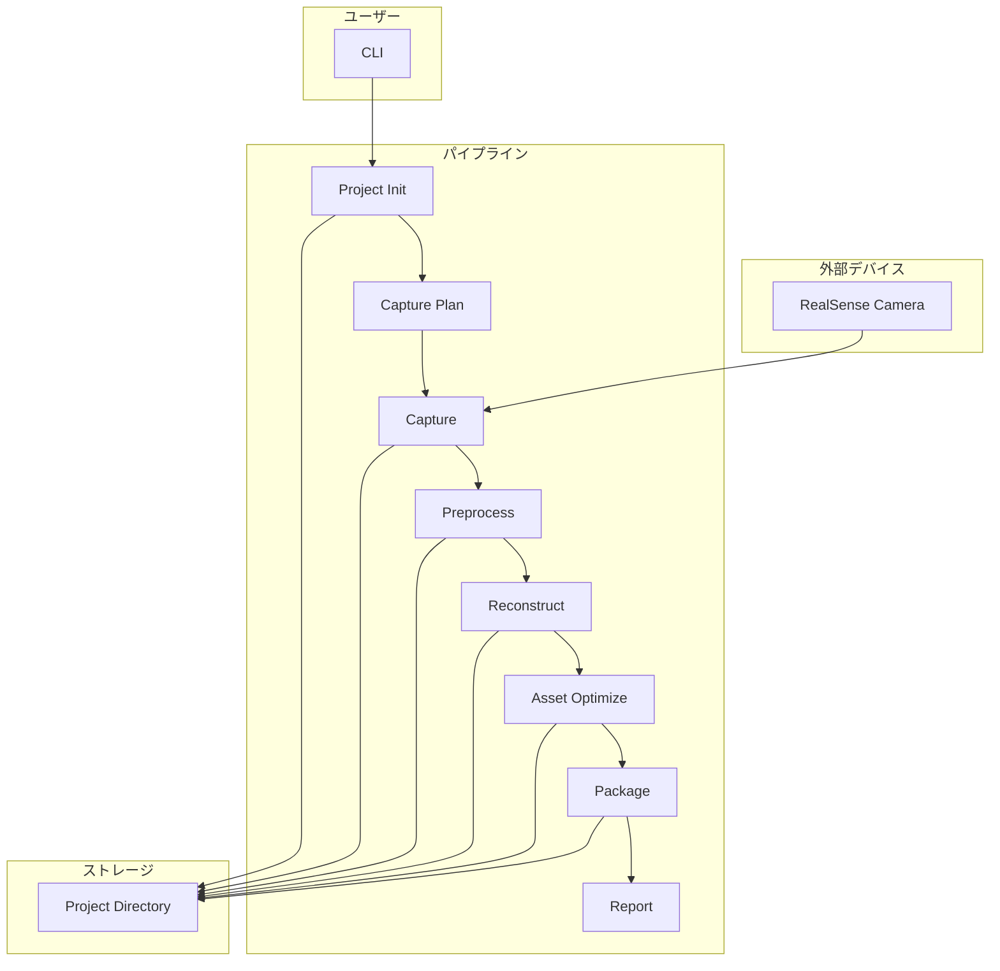
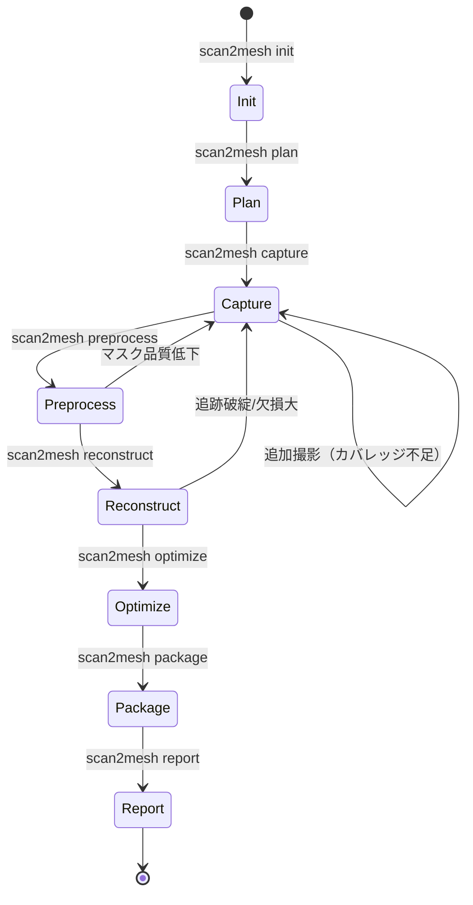
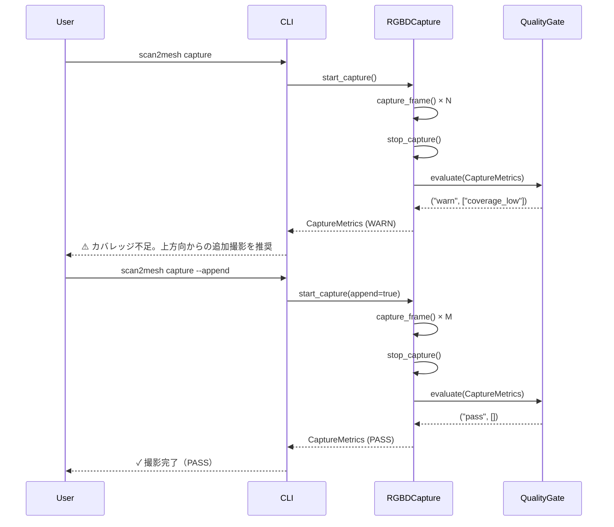
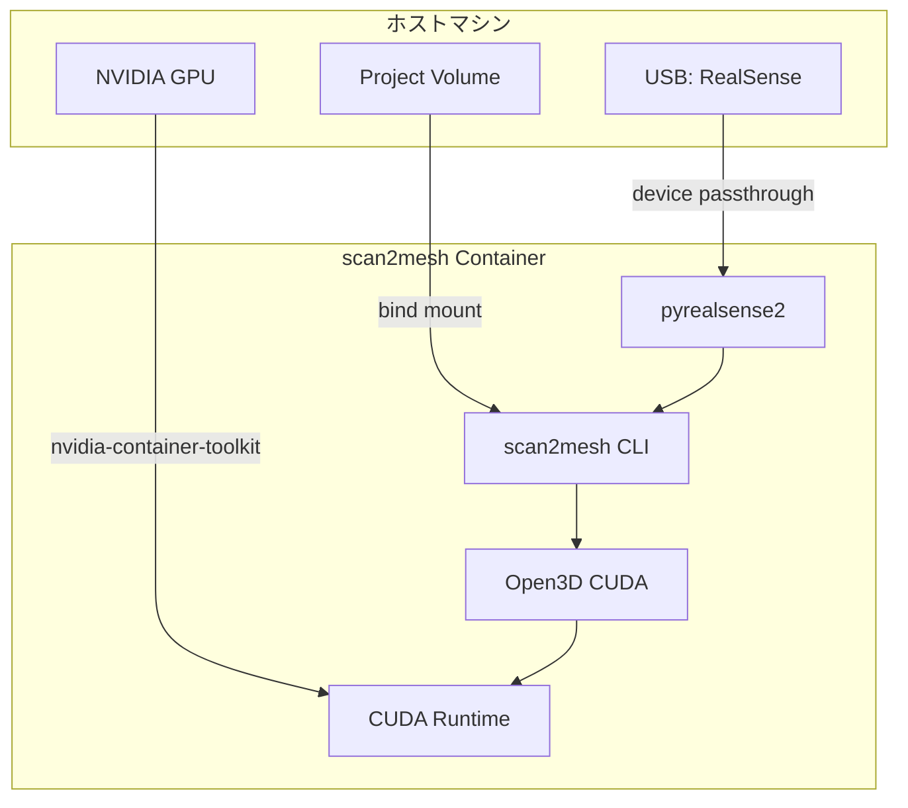

# 機能設計書 (Functional Design Document)

## システム構成図



## パイプライン全体フロー



## 技術スタック

| 分類 | 技術 | 選定理由 |
|------|------|----------|
| 言語 | Python 3.10+ | RealSense SDK、Open3D、科学計算ライブラリとの親和性 |
| CLIフレームワーク | Click / Typer | サブコマンド構造、型ヒント対応、自動ヘルプ生成 |
| カメラ制御 | pyrealsense2 | RealSense公式Python SDK |
| 3D処理 | Open3D (CUDA版) | RGBD処理、TSDF、メッシュ操作の統合ライブラリ、GPU高速化対応 |
| メッシュ最適化 | trimesh + pymeshlab | LOD生成、メッシュ修正、Convex hull |
| 画像処理 | OpenCV | RGB処理、ブラー検出、マスク生成 |
| 数値計算 | NumPy | 行列演算、点群処理 |
| 進捗表示 | rich / tqdm | プログレスバー、テーブル表示 |
| 設定管理 | pydantic | 型安全な設定バリデーション |
| 出力フォーマット | glTF 2.0 (pygltflib) | 業界標準の3Dフォーマット |
| コンテナ | Docker / Docker Compose | 環境の再現性、異なるデバイス間での共有 |
| GPU対応 | NVIDIA Container Toolkit | コンテナ内からGPU（CUDA）を利用 |

## データモデル定義

### プロジェクト設定: ProjectConfig

```python
from pydantic import BaseModel
from enum import Enum
from typing import Optional
from datetime import datetime

class CoordinateSystem(BaseModel):
    up_axis: str = "Z"           # "X", "Y", "Z"
    forward_axis: str = "Y"      # "X", "Y", "Z"
    origin: str = "bottom_center" # "bottom_center", "centroid"

class OutputPreset(BaseModel):
    coordinate_system: CoordinateSystem
    units: str = "meter"         # "meter", "millimeter"
    texture_resolution: int = 2048  # 最大テクスチャ解像度
    lod_triangle_limits: list[int] = [100000, 30000, 10000]  # LOD0, LOD1, LOD2

class ScaleInfo(BaseModel):
    method: str                  # "known_dimension", "realsense_depth_scale"
    known_dimension_mm: Optional[float] = None  # 既知の実寸（mm）
    dimension_type: Optional[str] = None  # "diameter", "length", "width", "height"
    uncertainty: str = "medium"  # "low", "medium", "high"

class ProjectConfig(BaseModel):
    schema_version: str = "1.0"
    object_name: str             # 例: "robocup_ball"
    class_id: int                # 例: 0
    tags: list[str] = []         # 例: ["ball", "robocup"]
    output_preset: OutputPreset
    scale_info: Optional[ScaleInfo] = None
    created_at: datetime
    updated_at: datetime
    config_hash: str             # 設定のハッシュ（再現性用）
```

### 撮影計画: CapturePlan

```python
class ViewPoint(BaseModel):
    index: int                   # 視点番号
    azimuth_deg: float           # 方位角（度）
    elevation_deg: float         # 仰角（度）
    distance_m: float            # 距離（メートル）
    order: int                   # 撮影順序

class CapturePlanPreset(str, Enum):
    QUICK = "quick"              # 16-20視点
    STANDARD = "standard"        # 24-36視点
    HARD = "hard"                # 追加補完

class CapturePlan(BaseModel):
    preset: CapturePlanPreset
    viewpoints: list[ViewPoint]
    min_required_frames: int     # 最低必要フレーム数
    recommended_distance_m: float  # 推奨距離
    notes: list[str] = []        # 撮影時の注意事項
```

### フレームデータ: FrameData

```python
class CameraIntrinsics(BaseModel):
    width: int
    height: int
    fx: float                    # 焦点距離X
    fy: float                    # 焦点距離Y
    cx: float                    # 主点X
    cy: float                    # 主点Y
    depth_scale: float           # 深度スケール

class FrameQuality(BaseModel):
    depth_valid_ratio: float     # 深度有効画素比 (0.0-1.0)
    blur_score: float            # ブラースコア (0.0-1.0, 高いほど鮮明)
    object_occupancy: float      # 物体占有率 (0.0-1.0)
    is_keyframe: bool            # キーフレームとして採用するか

class FrameData(BaseModel):
    frame_id: int
    timestamp: datetime
    rgb_path: str                # RGB画像パス
    depth_path: str              # Depth画像パス
    intrinsics: CameraIntrinsics
    quality: FrameQuality
    estimated_viewpoint: Optional[ViewPoint] = None  # 推定視点
```

### キャプチャメトリクス: CaptureMetrics

```python
class CaptureMetrics(BaseModel):
    num_frames_raw: int          # 撮影フレーム数
    num_keyframes: int           # キーフレーム数
    depth_valid_ratio_mean: float
    depth_valid_ratio_min: float
    blur_score_mean: float
    blur_score_min: float
    coverage_score: float        # 視点分布の均一性 (0.0-1.0)
    capture_duration_sec: float  # 撮影時間
    gate_status: str             # "pass", "warn", "fail"
    gate_reasons: list[str]      # ゲート判定理由
```

### マスクフレーム: MaskedFrame

```python
class MaskMethod(str, Enum):
    DEPTH_THRESHOLD = "depth_threshold"
    FLOOR_PLANE = "floor_plane"
    MANUAL_BOUNDING = "manual_bounding"

class MaskedFrame(BaseModel):
    frame_id: int
    rgb_masked_path: str         # マスク適用後RGB
    depth_masked_path: str       # マスク適用後Depth
    mask_path: str               # マスク画像パス
    mask_method: MaskMethod
    mask_area_ratio: float       # マスク面積比 (0.0-1.0)
    is_valid: bool               # 有効なマスクか
```

### 復元レポート: ReconReport

```python
class PoseEstimate(BaseModel):
    frame_id: int
    transformation: list[list[float]]  # 4x4変換行列
    fitness: float               # フィットネススコア
    inlier_rmse: float           # インライアRMSE

class ReconReport(BaseModel):
    num_frames_used: int         # 使用フレーム数
    tracking_success_rate: float # 追跡成功率 (0.0-1.0)
    alignment_rmse_mean: float   # 平均アライメントRMSE
    alignment_rmse_max: float    # 最大アライメントRMSE
    drift_indicator: float       # ドリフト指標
    poses: list[PoseEstimate]    # 各フレームの姿勢
    tsdf_voxel_size: float       # TSDFボクセルサイズ
    mesh_vertices: int           # メッシュ頂点数
    mesh_triangles: int          # メッシュ三角形数
    processing_time_sec: float   # 処理時間
    gate_status: str             # "pass", "warn", "fail"
    gate_reasons: list[str]
```

### アセットメトリクス: AssetMetrics

```python
class LODMetrics(BaseModel):
    level: int                   # 0, 1, 2
    triangles: int               # 三角形数
    vertices: int                # 頂点数
    file_size_bytes: int         # ファイルサイズ

class CollisionMetrics(BaseModel):
    method: str                  # "convex_hull", "vhacd"
    num_convex_parts: int        # 凸部品数（VHACDの場合）
    total_triangles: int         # 総三角形数

class AssetMetrics(BaseModel):
    lod_metrics: list[LODMetrics]
    collision_metrics: CollisionMetrics
    aabb_size: list[float]       # [x, y, z] メートル
    obb_size: list[float]        # [x, y, z] メートル
    hole_area_ratio: float       # 穴面積比 (0.0-1.0)
    non_manifold_edges: int      # 非多様体エッジ数
    texture_resolution: int      # テクスチャ解像度
    texture_coverage: float      # テクスチャカバレッジ (0.0-1.0)
    scale_uncertainty: str       # "low", "medium", "high"
    gate_status: str             # "pass", "warn", "fail"
    gate_reasons: list[str]
```

### マニフェスト: AssetManifest

```python
class Provenance(BaseModel):
    device: str                  # "Intel RealSense D435"
    tool_version: str            # "scan2mesh 0.1.0"
    date: str                    # "2026-01-05"
    config_hash: str             # 設定ハッシュ

class FileReferences(BaseModel):
    visual_lod0: str             # "asset/visual_lod0.glb"
    visual_lod1: str             # "asset/visual_lod1.glb"
    visual_lod2: str             # "asset/visual_lod2.glb"
    collision: str               # "asset/collision.obj"
    preview: str                 # "asset/preview.png"

class QualityStatus(BaseModel):
    status: str                  # "pass", "warn", "fail"
    reasons: list[str]           # ["hole_area_high", "scale_uncertain"]

class AssetManifest(BaseModel):
    schema_version: str = "1.0"
    object_name: str
    class_id: int
    tags: list[str]
    units: str                   # "meter"
    coordinate_system: CoordinateSystem
    scale: ScaleInfo
    files: FileReferences
    quality: QualityStatus
    provenance: Provenance
    capture_metrics: CaptureMetrics
    recon_metrics: ReconReport
    asset_metrics: AssetMetrics
```

## コンポーネント設計

### CLIレイヤー

```python
class CLI:
    """CLIコマンドの定義とルーティング"""

    def init(self, name: str, class_id: int, dimension: Optional[float]) -> None:
        """プロジェクト初期化"""
        pass

    def plan(self, preset: str) -> None:
        """撮影計画生成"""
        pass

    def capture(self, plan: Optional[str]) -> None:
        """RGBD撮影"""
        pass

    def preprocess(self, background_removal: str) -> None:
        """前処理"""
        pass

    def reconstruct(self) -> None:
        """3D復元"""
        pass

    def optimize(self, preset: str) -> None:
        """アセット最適化"""
        pass

    def package(self, out: str) -> None:
        """パッケージング"""
        pass

    def report(self) -> None:
        """品質レポート"""
        pass
```

### パイプラインステージ

#### Stage 1: ProjectInitializer

```python
class ProjectInitializer:
    """プロジェクト初期化"""

    def __init__(self, project_dir: Path):
        self.project_dir = project_dir

    def initialize(
        self,
        object_name: str,
        class_id: int,
        preset: OutputPreset,
        known_dimension: Optional[float] = None,
        dimension_type: Optional[str] = None
    ) -> ProjectConfig:
        """
        プロジェクトを初期化し、ディレクトリ構造を作成

        Returns:
            ProjectConfig: 作成されたプロジェクト設定
        """
        pass

    def load_config(self) -> ProjectConfig:
        """既存のプロジェクト設定を読み込み"""
        pass

    def save_config(self, config: ProjectConfig) -> None:
        """プロジェクト設定を保存"""
        pass
```

#### Stage 2: CapturePlanner

```python
class CapturePlanner:
    """撮影計画生成"""

    def generate_plan(self, preset: CapturePlanPreset) -> CapturePlan:
        """
        プリセットに基づいて撮影計画を生成

        Args:
            preset: quick, standard, hard のいずれか

        Returns:
            CapturePlan: 生成された撮影計画
        """
        pass

    def get_viewpoints(self, preset: CapturePlanPreset) -> list[ViewPoint]:
        """視点リストを生成"""
        pass
```

#### Stage 3: RGBDCapture

```python
class RGBDCapture:
    """RealSenseからのRGBD取得"""

    def __init__(self, project_dir: Path):
        self.project_dir = project_dir
        self.pipeline = None

    def start_capture(self, plan: CapturePlan) -> None:
        """撮影を開始"""
        pass

    def capture_frame(self) -> FrameData:
        """1フレームを取得"""
        pass

    def evaluate_quality(self, frame: FrameData) -> FrameQuality:
        """フレーム品質を評価"""
        pass

    def estimate_coverage(self, frames: list[FrameData]) -> float:
        """カバレッジを推定"""
        pass

    def stop_capture(self) -> CaptureMetrics:
        """撮影を終了し、メトリクスを返す"""
        pass
```

#### Stage 4: Preprocessor

```python
class Preprocessor:
    """前処理（フィルタリング、マスク生成）"""

    def __init__(self, project_dir: Path):
        self.project_dir = project_dir

    def filter_depth(self, depth: np.ndarray) -> np.ndarray:
        """深度フィルタリング（穴埋め、外れ値除去）"""
        pass

    def align_rgbd(self, rgb: np.ndarray, depth: np.ndarray) -> tuple[np.ndarray, np.ndarray]:
        """RGB-Dアラインメント"""
        pass

    def remove_background_depth(
        self,
        rgb: np.ndarray,
        depth: np.ndarray,
        threshold: float
    ) -> tuple[np.ndarray, np.ndarray, np.ndarray]:
        """深度閾値による背景除去"""
        pass

    def remove_background_floor(
        self,
        rgb: np.ndarray,
        depth: np.ndarray,
        intrinsics: CameraIntrinsics
    ) -> tuple[np.ndarray, np.ndarray, np.ndarray]:
        """床平面推定による背景除去"""
        pass

    def process_all(self, method: MaskMethod) -> list[MaskedFrame]:
        """全フレームを処理"""
        pass
```

#### Stage 5: Reconstructor

```python
class Reconstructor:
    """3D復元（姿勢推定、TSDF、メッシュ化）"""

    def __init__(self, project_dir: Path):
        self.project_dir = project_dir

    def estimate_poses(
        self,
        frames: list[MaskedFrame],
        intrinsics: CameraIntrinsics
    ) -> list[PoseEstimate]:
        """フレーム間の姿勢推定"""
        pass

    def fuse_tsdf(
        self,
        frames: list[MaskedFrame],
        poses: list[PoseEstimate],
        intrinsics: CameraIntrinsics,
        voxel_size: float = 0.002
    ) -> o3d.pipelines.integration.ScalableTSDFVolume:
        """TSDFフュージョン"""
        pass

    def extract_mesh(
        self,
        tsdf_volume: o3d.pipelines.integration.ScalableTSDFVolume
    ) -> o3d.geometry.TriangleMesh:
        """メッシュ抽出"""
        pass

    def generate_texture(
        self,
        mesh: o3d.geometry.TriangleMesh,
        frames: list[MaskedFrame],
        poses: list[PoseEstimate]
    ) -> o3d.geometry.TriangleMesh:
        """テクスチャ生成"""
        pass

    def reconstruct(self) -> ReconReport:
        """復元を実行"""
        pass
```

#### Stage 6: AssetOptimizer

```python
class AssetOptimizer:
    """アセット最適化"""

    def __init__(self, project_dir: Path, preset: OutputPreset):
        self.project_dir = project_dir
        self.preset = preset

    def apply_scale(
        self,
        mesh: o3d.geometry.TriangleMesh,
        scale_info: ScaleInfo
    ) -> o3d.geometry.TriangleMesh:
        """スケール適用"""
        pass

    def normalize_axes(
        self,
        mesh: o3d.geometry.TriangleMesh,
        coord_system: CoordinateSystem
    ) -> o3d.geometry.TriangleMesh:
        """軸/原点の正規化"""
        pass

    def repair_mesh(
        self,
        mesh: o3d.geometry.TriangleMesh
    ) -> o3d.geometry.TriangleMesh:
        """メッシュ修正（法線、非多様体、穴）"""
        pass

    def generate_lod(
        self,
        mesh: o3d.geometry.TriangleMesh,
        triangle_limits: list[int]
    ) -> list[o3d.geometry.TriangleMesh]:
        """LOD生成"""
        pass

    def generate_collision(
        self,
        mesh: o3d.geometry.TriangleMesh,
        method: str = "convex_hull"
    ) -> o3d.geometry.TriangleMesh:
        """衝突メッシュ生成"""
        pass

    def optimize_texture(
        self,
        mesh: o3d.geometry.TriangleMesh,
        max_resolution: int
    ) -> o3d.geometry.TriangleMesh:
        """テクスチャ最適化"""
        pass

    def optimize(self) -> AssetMetrics:
        """最適化を実行"""
        pass
```

#### Stage 7: Packager

```python
class Packager:
    """パッケージング"""

    def __init__(self, project_dir: Path):
        self.project_dir = project_dir

    def create_bundle_structure(self, output_dir: Path) -> None:
        """バンドルのディレクトリ構造を作成"""
        pass

    def generate_manifest(self) -> AssetManifest:
        """マニフェスト生成"""
        pass

    def generate_preview(
        self,
        mesh: o3d.geometry.TriangleMesh
    ) -> np.ndarray:
        """プレビュー画像生成"""
        pass

    def export_glb(
        self,
        mesh: o3d.geometry.TriangleMesh,
        output_path: Path
    ) -> None:
        """GLB形式でエクスポート"""
        pass

    def package(self, output_path: Path, as_zip: bool = False) -> None:
        """パッケージング実行"""
        pass
```

#### Stage 8: QualityReporter

```python
class QualityReporter:
    """品質レポート生成"""

    def __init__(self, project_dir: Path):
        self.project_dir = project_dir

    def load_all_metrics(self) -> tuple[CaptureMetrics, ReconReport, AssetMetrics]:
        """全メトリクスを読み込み"""
        pass

    def evaluate_overall_quality(
        self,
        capture: CaptureMetrics,
        recon: ReconReport,
        asset: AssetMetrics
    ) -> QualityStatus:
        """総合品質評価"""
        pass

    def suggest_next_action(self, quality: QualityStatus) -> list[str]:
        """次アクションの提案"""
        pass

    def generate_report(self) -> str:
        """レポート生成（テキスト形式）"""
        pass
```

## アルゴリズム設計

### 品質ゲート判定アルゴリズム

#### キャプチャ品質ゲート

```python
class CaptureQualityGate:
    """キャプチャ品質の判定"""

    # 閾値定義
    DEPTH_VALID_RATIO_WARN = 0.7
    DEPTH_VALID_RATIO_FAIL = 0.5
    BLUR_SCORE_WARN = 0.6
    BLUR_SCORE_FAIL = 0.4
    COVERAGE_WARN = 0.7
    COVERAGE_FAIL = 0.5
    MIN_KEYFRAMES = 10

    def evaluate(self, metrics: CaptureMetrics) -> tuple[str, list[str]]:
        """
        キャプチャ品質を評価

        Returns:
            (status, reasons): "pass"/"warn"/"fail" と理由のリスト
        """
        reasons = []
        status = "pass"

        # 深度有効率チェック
        if metrics.depth_valid_ratio_mean < self.DEPTH_VALID_RATIO_FAIL:
            status = "fail"
            reasons.append("depth_valid_ratio_critical")
        elif metrics.depth_valid_ratio_mean < self.DEPTH_VALID_RATIO_WARN:
            if status != "fail":
                status = "warn"
            reasons.append("depth_valid_ratio_low")

        # ブラースコアチェック
        if metrics.blur_score_mean < self.BLUR_SCORE_FAIL:
            status = "fail"
            reasons.append("blur_score_critical")
        elif metrics.blur_score_mean < self.BLUR_SCORE_WARN:
            if status != "fail":
                status = "warn"
            reasons.append("blur_score_low")

        # カバレッジチェック
        if metrics.coverage_score < self.COVERAGE_FAIL:
            status = "fail"
            reasons.append("coverage_insufficient")
        elif metrics.coverage_score < self.COVERAGE_WARN:
            if status != "fail":
                status = "warn"
            reasons.append("coverage_low")

        # キーフレーム数チェック
        if metrics.num_keyframes < self.MIN_KEYFRAMES:
            status = "fail"
            reasons.append("keyframes_insufficient")

        return status, reasons
```

#### 復元品質ゲート

```python
class ReconQualityGate:
    """復元品質の判定"""

    TRACKING_SUCCESS_RATE_WARN = 0.9
    TRACKING_SUCCESS_RATE_FAIL = 0.7
    ALIGNMENT_RMSE_WARN = 0.005  # 5mm
    ALIGNMENT_RMSE_FAIL = 0.01   # 10mm
    DRIFT_WARN = 0.02            # 2cm
    DRIFT_FAIL = 0.05            # 5cm

    def evaluate(self, report: ReconReport) -> tuple[str, list[str]]:
        """復元品質を評価"""
        reasons = []
        status = "pass"

        # 追跡成功率
        if report.tracking_success_rate < self.TRACKING_SUCCESS_RATE_FAIL:
            status = "fail"
            reasons.append("tracking_failed")
        elif report.tracking_success_rate < self.TRACKING_SUCCESS_RATE_WARN:
            if status != "fail":
                status = "warn"
            reasons.append("tracking_unstable")

        # アライメントRMSE
        if report.alignment_rmse_max > self.ALIGNMENT_RMSE_FAIL:
            status = "fail"
            reasons.append("alignment_poor")
        elif report.alignment_rmse_max > self.ALIGNMENT_RMSE_WARN:
            if status != "fail":
                status = "warn"
            reasons.append("alignment_marginal")

        # ドリフト
        if report.drift_indicator > self.DRIFT_FAIL:
            status = "fail"
            reasons.append("drift_critical")
        elif report.drift_indicator > self.DRIFT_WARN:
            if status != "fail":
                status = "warn"
            reasons.append("drift_detected")

        return status, reasons
```

#### アセット品質ゲート

```python
class AssetQualityGate:
    """アセット品質の判定"""

    HOLE_AREA_RATIO_WARN = 0.05   # 5%
    HOLE_AREA_RATIO_FAIL = 0.15  # 15%
    NON_MANIFOLD_WARN = 10
    NON_MANIFOLD_FAIL = 100
    MAX_TRIANGLES_LOD0 = 100000
    MIN_TEXTURE_COVERAGE = 0.8

    def evaluate(self, metrics: AssetMetrics) -> tuple[str, list[str]]:
        """アセット品質を評価"""
        reasons = []
        status = "pass"

        # 穴面積比
        if metrics.hole_area_ratio > self.HOLE_AREA_RATIO_FAIL:
            status = "fail"
            reasons.append("hole_area_critical")
        elif metrics.hole_area_ratio > self.HOLE_AREA_RATIO_WARN:
            if status != "fail":
                status = "warn"
            reasons.append("hole_area_high")

        # 非多様体エッジ
        if metrics.non_manifold_edges > self.NON_MANIFOLD_FAIL:
            status = "fail"
            reasons.append("mesh_invalid")
        elif metrics.non_manifold_edges > self.NON_MANIFOLD_WARN:
            if status != "fail":
                status = "warn"
            reasons.append("mesh_quality_low")

        # 三角形数
        if metrics.lod_metrics[0].triangles > self.MAX_TRIANGLES_LOD0:
            if status != "fail":
                status = "warn"
            reasons.append("triangle_count_high")

        # テクスチャカバレッジ
        if metrics.texture_coverage < self.MIN_TEXTURE_COVERAGE:
            if status != "fail":
                status = "warn"
            reasons.append("texture_incomplete")

        # スケール不確かさ
        if metrics.scale_uncertainty == "high":
            if status != "fail":
                status = "warn"
            reasons.append("scale_uncertain")

        return status, reasons
```

### ブラー検出アルゴリズム

```python
def calculate_blur_score(image: np.ndarray) -> float:
    """
    Laplacian分散によるブラー検出

    Args:
        image: BGR画像

    Returns:
        blur_score: 0.0-1.0 (高いほど鮮明)
    """
    gray = cv2.cvtColor(image, cv2.COLOR_BGR2GRAY)
    laplacian_var = cv2.Laplacian(gray, cv2.CV_64F).var()

    # 正規化（経験的な閾値）
    # 100未満: ぼやけ、500以上: 鮮明
    score = min(1.0, max(0.0, (laplacian_var - 100) / 400))
    return score
```

### カバレッジ推定アルゴリズム

```python
def calculate_coverage_score(viewpoints: list[ViewPoint]) -> float:
    """
    視点分布の均一性を評価

    Args:
        viewpoints: 撮影済み視点リスト

    Returns:
        coverage_score: 0.0-1.0 (高いほど均一)
    """
    if len(viewpoints) < 3:
        return 0.0

    # 方位角と仰角の分布を評価
    azimuths = [v.azimuth_deg for v in viewpoints]
    elevations = [v.elevation_deg for v in viewpoints]

    # 方位角の均一性（理想: 360度を均等にカバー）
    azimuth_bins = np.histogram(azimuths, bins=8, range=(0, 360))[0]
    azimuth_uniformity = 1.0 - np.std(azimuth_bins) / np.mean(azimuth_bins)

    # 仰角の分布（理想: -30〜60度をカバー）
    elevation_range = max(elevations) - min(elevations)
    elevation_coverage = min(1.0, elevation_range / 90.0)

    # 総合スコア
    coverage_score = (azimuth_uniformity * 0.6 + elevation_coverage * 0.4)
    return max(0.0, min(1.0, coverage_score))
```

### 床平面推定アルゴリズム

```python
def estimate_floor_plane(
    depth: np.ndarray,
    intrinsics: CameraIntrinsics,
    ransac_threshold: float = 0.01
) -> tuple[np.ndarray, float]:
    """
    RANSACによる床平面推定

    Args:
        depth: 深度画像
        intrinsics: カメラ内部パラメータ
        ransac_threshold: RANSACの閾値（メートル）

    Returns:
        (plane_normal, plane_d): 平面の法線と距離
    """
    # 深度画像を点群に変換
    points = depth_to_pointcloud(depth, intrinsics)

    # 下部領域の点を抽出（床の候補）
    floor_candidates = points[points[:, 2] < np.percentile(points[:, 2], 20)]

    # RANSACで平面フィッティング
    pcd = o3d.geometry.PointCloud()
    pcd.points = o3d.utility.Vector3dVector(floor_candidates)
    plane_model, inliers = pcd.segment_plane(
        distance_threshold=ransac_threshold,
        ransac_n=3,
        num_iterations=1000
    )

    return plane_model[:3], plane_model[3]
```

## ユースケース図

### ユースケース1: 基本的なスキャンフロー

```mermaid
sequenceDiagram
    participant User
    participant CLI
    participant Init as ProjectInitializer
    participant Plan as CapturePlanner
    participant Cap as RGBDCapture
    participant Pre as Preprocessor
    participant Rec as Reconstructor
    participant Opt as AssetOptimizer
    participant Pkg as Packager
    participant Rep as QualityReporter

    User->>CLI: scan2mesh init --name ball --class-id 0
    CLI->>Init: initialize()
    Init-->>CLI: ProjectConfig
    CLI-->>User: プロジェクト作成完了

    User->>CLI: scan2mesh plan --preset standard
    CLI->>Plan: generate_plan(standard)
    Plan-->>CLI: CapturePlan
    CLI-->>User: 撮影計画生成完了（24視点）

    User->>CLI: scan2mesh capture
    CLI->>Cap: start_capture()
    loop 撮影ループ
        Cap->>Cap: capture_frame()
        Cap->>Cap: evaluate_quality()
        Cap-->>User: 品質フィードバック（リアルタイム）
    end
    Cap->>Cap: stop_capture()
    Cap-->>CLI: CaptureMetrics
    CLI-->>User: 撮影完了（PASS）

    User->>CLI: scan2mesh preprocess
    CLI->>Pre: process_all()
    Pre-->>CLI: list[MaskedFrame]
    CLI-->>User: 前処理完了

    User->>CLI: scan2mesh reconstruct
    CLI->>Rec: reconstruct()
    Rec-->>CLI: ReconReport
    CLI-->>User: 復元完了（PASS）

    User->>CLI: scan2mesh optimize
    CLI->>Opt: optimize()
    Opt-->>CLI: AssetMetrics
    CLI-->>User: 最適化完了

    User->>CLI: scan2mesh package --out bundle.zip
    CLI->>Pkg: package()
    Pkg-->>CLI: success
    CLI-->>User: パッケージング完了

    User->>CLI: scan2mesh report
    CLI->>Rep: generate_report()
    Rep-->>CLI: レポート
    CLI-->>User: 品質レポート表示
```

### ユースケース2: 品質ゲートによる再撮影フロー



## ファイル構造

### プロジェクトディレクトリ構造

```
project_name/
├── project.json              # プロジェクト設定
├── capture_plan.json         # 撮影計画
├── raw_frames/               # 生フレームデータ
│   ├── frame_0000_rgb.png
│   ├── frame_0000_depth.png
│   ├── frame_0001_rgb.png
│   ├── frame_0001_depth.png
│   └── ...
├── keyframes/                # キーフレーム（選別後）
│   └── ...
├── masked_frames/            # マスク適用済みフレーム
│   ├── frame_0000_rgb_masked.png
│   ├── frame_0000_depth_masked.png
│   ├── frame_0000_mask.png
│   └── ...
├── recon/                    # 復元結果
│   ├── pointcloud.ply
│   ├── mesh_raw.glb
│   └── recon_report.json
├── asset/                    # 最適化済みアセット
│   ├── visual_lod0.glb
│   ├── visual_lod1.glb
│   ├── visual_lod2.glb
│   ├── collision.obj
│   ├── preview.png
│   └── asset_metrics.json
├── metrics/                  # メトリクス
│   ├── capture_metrics.json
│   ├── mask_quality.json
│   └── frames_metadata.json
└── logs/                     # ログ
    └── scan2mesh.log
```

### 配布バンドル構造

```
bundle/
├── manifest.json             # メタデータ
├── README.md                 # 使用方法
├── licenses/                 # ライセンス情報
├── source/                   # 元データの要約
│   ├── capture_plan.json
│   ├── project.json
│   ├── recon_report.json
│   └── raw_summary.json
├── asset/                    # アセット本体
│   ├── visual_lod0.glb
│   ├── visual_lod1.glb
│   ├── visual_lod2.glb
│   ├── collision.obj
│   └── preview.png
└── metrics/                  # 品質メトリクス
    ├── asset_metrics.json
    └── capture_metrics.json
```

## CLI出力設計

### テーブル表示（品質レポート）

```
┌─────────────────────────────────────────────────────────────────┐
│                      scan2mesh Quality Report                    │
├─────────────────────────────────────────────────────────────────┤
│ Object: robocup_ball (class_id: 0)                              │
│ Date: 2026-01-05 14:32:00                                       │
├─────────────────────────────────────────────────────────────────┤
│                         CAPTURE METRICS                          │
├──────────────────────┬──────────────┬────────────────────────────┤
│ Metric               │ Value        │ Status                     │
├──────────────────────┼──────────────┼────────────────────────────┤
│ Raw Frames           │ 150          │                            │
│ Keyframes            │ 28           │ ✓                          │
│ Depth Valid Ratio    │ 0.85         │ ✓                          │
│ Blur Score           │ 0.78         │ ✓                          │
│ Coverage             │ 0.92         │ ✓                          │
├──────────────────────┴──────────────┴────────────────────────────┤
│                       RECONSTRUCTION METRICS                     │
├──────────────────────┬──────────────┬────────────────────────────┤
│ Tracking Success     │ 96.4%        │ ✓                          │
│ Alignment RMSE       │ 2.3mm        │ ✓                          │
│ Drift Indicator      │ 8mm          │ ✓                          │
├──────────────────────┴──────────────┴────────────────────────────┤
│                          ASSET METRICS                           │
├──────────────────────┬──────────────┬────────────────────────────┤
│ LOD0 Triangles       │ 45,230       │ ✓                          │
│ Hole Area Ratio      │ 2.1%         │ ✓                          │
│ Non-manifold Edges   │ 0            │ ✓                          │
│ Texture Coverage     │ 94%          │ ✓                          │
│ Scale Uncertainty    │ low          │ ✓                          │
├──────────────────────┴──────────────┴────────────────────────────┤
│                         OVERALL STATUS                           │
├─────────────────────────────────────────────────────────────────┤
│                           ✓ PASS                                 │
│                                                                  │
│ Asset is ready for distribution.                                 │
└─────────────────────────────────────────────────────────────────┘
```

### カラーコーディング

| 要素 | 色 | 用途 |
|------|-----|------|
| PASS | 緑 | 品質ゲート通過 |
| WARN | 黄 | 警告（使用可能だが注意） |
| FAIL | 赤 | 失敗（再撮影/修正が必要） |
| ✓ | 緑 | 個別項目OK |
| ⚠ | 黄 | 個別項目警告 |
| ✗ | 赤 | 個別項目NG |

### プログレス表示

```
[Capturing] ████████████████████░░░░░░░░░░ 65% (26/40 frames)
  Depth Valid: 0.87 | Blur: 0.82 | Coverage: 0.73

[Reconstructing] ████████████████████████░░░░░░ 78%
  TSDF Integration: 28/36 frames | ETA: 00:42
```

## エラーハンドリング

### エラーの分類と対処

| エラー種別 | 原因 | ユーザーへの表示 | 推奨アクション |
|-----------|------|-----------------|---------------|
| CameraNotFound | RealSenseが接続されていない | "RealSenseカメラが見つかりません。接続を確認してください。" | カメラを接続して再実行 |
| CameraStreamError | カメラストリームの取得失敗 | "カメラストリームの取得に失敗しました。USBポートを変更してください。" | USB3.0ポートに接続 |
| ProjectNotInitialized | プロジェクト未初期化 | "プロジェクトが初期化されていません。`scan2mesh init`を実行してください。" | initを実行 |
| InsufficientFrames | フレーム数不足 | "キーフレームが不足しています（現在: 5, 必要: 10）。追加撮影してください。" | captureを再実行 |
| TrackingLost | 姿勢推定の破綻 | "追跡が破綻しました。撮影をやり直してください。カメラをゆっくり動かしてください。" | captureからやり直し |
| MeshGenerationFailed | メッシュ生成失敗 | "メッシュの生成に失敗しました。撮影データを確認してください。" | データを確認、再撮影 |
| DiskSpaceInsufficient | ディスク容量不足 | "ディスク容量が不足しています（必要: 2GB, 空き: 500MB）。" | 空き容量を確保 |

## Docker環境設計

### 設計方針

scan2meshはDockerコンテナ内で動作することを前提とする。これにより：
- 異なるデバイス間で同一の実行環境を共有できる
- 依存関係の衝突を回避できる
- セットアップの手間を最小化できる

### コンテナ構成



### ベースイメージ

```dockerfile
# ベースイメージ: NVIDIA CUDA + Ubuntu 22.04
FROM nvidia/cuda:12.2-runtime-ubuntu22.04

# 主要な依存関係
# - librealsense2: RealSense SDK
# - Open3D (CUDA版): 3D処理
# - Python 3.10+: アプリケーション実行環境
```

### デバイスアクセス設定

#### RealSenseカメラ（USBデバイスパススルー）

```yaml
# docker-compose.yml での設定例
services:
  scan2mesh:
    devices:
      - /dev/bus/usb:/dev/bus/usb  # USB全体をパススルー
    privileged: true  # または細かいcapabilities指定
```

**ホスト側の準備（udevルール）**:
```bash
# /etc/udev/rules.d/99-realsense-libusb.rules
SUBSYSTEM=="usb", ATTRS{idVendor}=="8086", MODE="0666"
```

#### GPU（NVIDIA Container Toolkit）

```yaml
# docker-compose.yml での設定例
services:
  scan2mesh:
    deploy:
      resources:
        reservations:
          devices:
            - driver: nvidia
              count: 1
              capabilities: [gpu]
```

### docker-compose.yml 概要設計

```yaml
version: '3.8'

services:
  scan2mesh:
    image: scan2mesh:latest
    build:
      context: .
      dockerfile: Dockerfile

    # GPU対応
    deploy:
      resources:
        reservations:
          devices:
            - driver: nvidia
              count: 1
              capabilities: [gpu]

    # RealSenseカメラアクセス
    devices:
      - /dev/bus/usb:/dev/bus/usb
    privileged: true

    # プロジェクトディレクトリのマウント
    volumes:
      - ./projects:/workspace/projects
      - ./config:/workspace/config:ro

    # 環境変数
    environment:
      - CUDA_VISIBLE_DEVICES=0
      - SCAN2MESH_LOG_LEVEL=INFO

    # 作業ディレクトリ
    working_dir: /workspace

    # インタラクティブモード（撮影時に必要）
    stdin_open: true
    tty: true
```

### 実行モード

#### 1. インタラクティブモード（撮影用）

```bash
# コンテナに入って撮影を実行
docker compose run --rm scan2mesh bash
> scan2mesh init --name ball --class-id 0
> scan2mesh capture
```

#### 2. バッチモード（処理用）

```bash
# 撮影済みデータの処理を一括実行
docker compose run --rm scan2mesh scan2mesh reconstruct
docker compose run --rm scan2mesh scan2mesh optimize
docker compose run --rm scan2mesh scan2mesh package --out /workspace/projects/ball/bundle.zip
```

### 前提条件

ホストマシンに以下がインストールされていること：

| 要件 | バージョン | 確認コマンド |
|------|-----------|-------------|
| Docker | 24.0+ | `docker --version` |
| Docker Compose | 2.20+ | `docker compose version` |
| NVIDIA Driver | 525+ | `nvidia-smi` |
| NVIDIA Container Toolkit | 1.14+ | `nvidia-ctk --version` |

### 制約事項

- **X11転送**: GUIプレビューが必要な場合は追加設定が必要（`-e DISPLAY -v /tmp/.X11-unix:/tmp/.X11-unix`）
- **パフォーマンス**: USBパススルーのオーバーヘッドは無視できるレベル
- **権限**: `privileged: true` または適切なcapabilities設定が必要

## テスト戦略

### ユニットテスト

- **品質ゲート判定**: 各閾値でPASS/WARN/FAILが正しく判定されるか
- **ブラー検出**: 鮮明/ぼやけ画像で適切なスコアが返るか
- **カバレッジ計算**: 視点分布に応じたスコアが返るか
- **データモデル**: Pydanticモデルのバリデーションが正しく動作するか

### 統合テスト

- **パイプライン全体フロー**: init→capture→...→packageが正常に完了するか
- **品質ゲートによる中断**: FAIL時に適切なエラーとリカバリーパスが提示されるか
- **再開機能**: 中断後に途中から再開できるか

### E2Eテスト

- **実機テスト**: 実際のRealSenseで撮影からアセット生成まで完了できるか
- **サンプルオブジェクト**: 球体、立方体、複雑形状でそれぞれ品質基準を満たすか
- **配布バンドル検証**: 生成されたバンドルが次工程で読み込めるか
