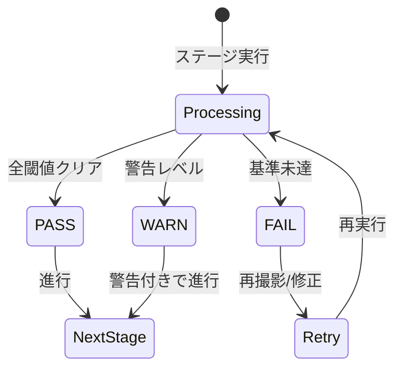

# プロジェクト用語集 (Glossary)

## 概要

このドキュメントは、scan2meshプロジェクトで使用される用語の定義を管理します。

**更新日**: 2026-01-05

## ドメイン用語

プロジェクト固有のビジネス概念や機能に関する用語。

### scan2mesh

**定義**: RealSenseカメラで撮影したRGBDデータから、シミュレーション・機械学習用の3Dアセットを自動生成するCLIツール

**説明**: 7ステージのパイプラインで構成され、撮影から配布可能なアセットバンドル生成までを一貫して処理する。各ステージには品質ゲートが設けられ、生成されたアセットの品質を自動判定する。

**関連用語**: パイプライン、品質ゲート、アセットバンドル

**使用例**:
- `scan2mesh init --name ball --class-id 0`
- `scan2mesh capture --plan standard`

**英語表記**: scan2mesh

### 品質ゲート

**定義**: 各パイプラインステージの出力品質を自動判定し、PASS/WARN/FAILのステータスを付与する仕組み

**説明**: キャプチャ品質ゲート、復元品質ゲート、アセット品質ゲートの3種類がある。閾値ベースの判定を行い、基準を満たさない場合は再撮影や修正を促すフィードバックを提供する。

**関連用語**: ステータス、CaptureMetrics、ReconReport、AssetMetrics

**使用例**:
- 深度有効率が50%未満の場合、キャプチャ品質ゲートはFAILを返す
- 追跡成功率が90%未満の場合、復元品質ゲートはWARNを返す

**英語表記**: Quality Gate

### パイプライン

**定義**: scan2meshの処理フローを構成する7つの連続したステージ

**説明**: Init → Plan → Capture → Preprocess → Reconstruct → Optimize → Package → Reportの順で実行される。各ステージは独立して実行可能で、中間結果はファイルシステムに永続化される。

**関連用語**: ステージ、Pipeline Orchestrator

**使用例**:
- パイプラインの各ステージはCLIコマンドに対応する
- 品質ゲートでFAILになると、前のステージへの差し戻しが提案される

**英語表記**: Pipeline

### キーフレーム

**定義**: 品質基準（深度有効率、ブラースコア、物体占有率）を満たし、3D復元に使用されるフレーム

**説明**: 撮影された全フレームの中から、品質スコアに基づいて選別される。キーフレーム数が最低ライン（10フレーム）を下回ると品質ゲートがFAILとなる。

**関連用語**: FrameData、FrameQuality、カバレッジ

**使用例**:
- 150フレーム撮影し、28フレームがキーフレームとして選別された
- キーフレーム不足の場合は追加撮影を促す

**英語表記**: Keyframe

### アセットバンドル

**定義**: 配布可能な形式でパッケージングされた3Dアセット一式

**説明**: manifest.json、LOD別メッシュ（visual_lod0-2.glb）、衝突メッシュ（collision.obj）、プレビュー画像（preview.png）、品質メトリクスを含む。ZIPまたはフォルダ形式で出力される。

**関連用語**: AssetManifest、LOD、衝突メッシュ

**使用例**:
- `scan2mesh package --out bundle.zip` でアセットバンドルを生成
- アセットバンドルはシミュレータや合成データ生成パイプラインに投入可能

**英語表記**: Asset Bundle

### カバレッジ

**定義**: 撮影時の視点分布の均一性を示すスコア（0.0-1.0）

**説明**: 方位角（360度を8分割）の均一性と仰角の範囲から算出される。高いカバレッジは物体の全周が均等に撮影されていることを意味し、欠損の少ない3D復元につながる。

**関連用語**: ViewPoint、キーフレーム

**使用例**:
- カバレッジスコア0.7未満は品質ゲートでWARN
- 上方向からの撮影を追加することでカバレッジを改善

**英語表記**: Coverage

### 衝突メッシュ

**定義**: 物理シミュレーションで使用する簡略化されたメッシュ

**説明**: Convex hull（凸包）またはVHACD（凸分解）で生成される。視覚用メッシュより大幅に簡略化され、高速な衝突検出を可能にする。

**関連用語**: VHACD、Convex hull、AssetMetrics

**使用例**:
- collision.objとしてアセットバンドルに含まれる
- シミュレータの物理エンジンで使用される

**英語表記**: Collision Mesh

## 技術用語

プロジェクトで使用している技術・フレームワーク・ツールに関する用語。

### RealSense

**定義**: Intel製のRGBDカメラシリーズ。RGB画像と深度情報を同時に取得できる

**公式サイト**: https://www.intelrealsense.com/

**本プロジェクトでの用途**: 3Dスキャンの入力デバイス。D400シリーズ（D415、D435、D455）に対応

**バージョン**: pyrealsense2 2.55+

**関連ドキュメント**: docs/architecture.md

### Open3D

**定義**: 3Dデータ処理のためのオープンソースライブラリ

**公式サイト**: http://www.open3d.org/

**本プロジェクトでの用途**: RGBD処理、TSDFフュージョン、メッシュ操作、点群処理。CUDA対応版を使用しGPU高速化を実現

**バージョン**: 0.18+

**関連ドキュメント**: docs/architecture.md

### Pydantic

**定義**: Pythonのデータバリデーションライブラリ

**公式サイト**: https://docs.pydantic.dev/

**本プロジェクトでの用途**: プロジェクト設定、メトリクス、マニフェストなどのデータモデル定義と型検証

**バージョン**: 2.6+

**関連ドキュメント**: docs/functional-design.md

### Typer

**定義**: PythonのCLIフレームワーク。Click上に構築され、型ヒントを活用

**公式サイト**: https://typer.tiangolo.com/

**本プロジェクトでの用途**: scan2meshのCLIインターフェース構築。サブコマンド構造、自動ヘルプ生成

**バージョン**: 0.12+

**関連ドキュメント**: docs/architecture.md

### Docker

**定義**: コンテナ仮想化プラットフォーム

**公式サイト**: https://www.docker.com/

**本プロジェクトでの用途**: 実行環境の再現性確保、異なるデバイス間での環境共有。USBデバイスパススルーでRealSenseにアクセス

**バージョン**: 24.0+

**関連ドキュメント**: docs/functional-design.md

### NVIDIA Container Toolkit

**定義**: Dockerコンテナ内からNVIDIA GPUにアクセスするためのツールキット

**公式サイト**: https://docs.nvidia.com/datacenter/cloud-native/container-toolkit/

**本プロジェクトでの用途**: コンテナ内でのCUDA処理、Open3DのGPU高速化

**バージョン**: 1.14+

**関連ドキュメント**: docs/architecture.md

### trimesh

**定義**: Pythonの3Dメッシュ処理ライブラリ

**公式サイト**: https://trimsh.org/

**本プロジェクトでの用途**: LOD生成、メッシュ形式変換、メッシュ検証

**バージョン**: 4.4+

**関連ドキュメント**: docs/architecture.md

### pymeshlab

**定義**: MeshLabのPythonバインディング

**公式サイト**: https://pymeshlab.readthedocs.io/

**本プロジェクトでの用途**: 非多様体修正、穴埋め、メッシュ簡略化

**バージョン**: 2023.12+

**関連ドキュメント**: docs/architecture.md

## 略語・頭字語

### RGBD

**正式名称**: RGB + Depth

**意味**: カラー画像（RGB）と深度画像（Depth）の組み合わせ。RealSenseなどの深度カメラで取得される

**本プロジェクトでの使用**: 撮影データの基本形式。RGB画像と深度画像のペアで1フレームを構成

### LOD

**正式名称**: Level of Detail

**意味**: 詳細度レベル。距離や用途に応じて異なる解像度のモデルを使い分ける技術

**本プロジェクトでの使用**: 3段階のLODを生成（LOD0: ~100k tris、LOD1: ~30k、LOD2: ~10k）

### TSDF

**正式名称**: Truncated Signed Distance Function

**意味**: 各ボクセルに対して最も近い表面までの符号付き距離を格納する3D表現。複数視点のRGBDデータを統合する手法

**本プロジェクトでの使用**: 3D復元（Reconstruct）ステージでフレームを統合し、メッシュを抽出

### SLAM

**正式名称**: Simultaneous Localization and Mapping

**意味**: 自己位置推定と環境地図作成を同時に行う技術

**本プロジェクトでの使用**: 現在はRGBD odometryで姿勢推定。将来的にターンテーブル+IMUでSLAMレス撮影を実現予定

### IMU

**正式名称**: Inertial Measurement Unit

**意味**: 加速度センサーとジャイロセンサーを組み合わせた慣性計測装置

**本プロジェクトでの使用**: 将来機能として、カメラの姿勢を正確に取得しSLAMレス撮影を実現

### RMSE

**正式名称**: Root Mean Square Error

**意味**: 二乗平均平方根誤差。推定値と真値の差を表す指標

**本プロジェクトでの使用**: フレーム間アライメントの精度評価（alignment_rmse）

### AABB

**正式名称**: Axis-Aligned Bounding Box

**意味**: 軸に平行な辺を持つ最小の直方体。物体を囲む単純な境界ボックス

**本プロジェクトでの使用**: アセットのサイズ情報として記録（aabb_size）

### OBB

**正式名称**: Oriented Bounding Box

**意味**: 任意の向きを持つ最小の直方体。AABBより物体にタイトにフィット

**本プロジェクトでの使用**: アセットのサイズ情報として記録（obb_size）

### VHACD

**正式名称**: Volumetric Hierarchical Approximate Convex Decomposition

**意味**: 複雑な形状を複数の凸形状に分解するアルゴリズム

**本プロジェクトでの使用**: 凹形状の物体に対する衝突メッシュ生成のオプション

### glTF

**正式名称**: GL Transmission Format

**意味**: Khronos Groupが策定した3Dモデルの標準フォーマット

**本プロジェクトでの使用**: アセットの出力形式。GLB（バイナリglTF）形式で保存

### GLB

**正式名称**: Binary glTF

**意味**: glTFのバイナリ形式。テクスチャを内包し、単一ファイルで配布可能

**本プロジェクトでの使用**: 視覚用メッシュの出力形式（visual_lod0.glb等）

### MVP

**正式名称**: Minimum Viable Product

**意味**: 最小限の機能を持つ実用可能な製品

**本プロジェクトでの使用**: PRDで定義された8つのコア機能がMVPを構成

### CLI

**正式名称**: Command Line Interface

**意味**: コマンドラインで操作するインターフェース

**本プロジェクトでの使用**: scan2meshはCLIツールとして実装。GUIは将来の拡張として検討

## アーキテクチャ用語

システム設計・アーキテクチャに関する用語。

### CLI Layer

**定義**: ユーザー入力の受付、バリデーション、結果の表示を担当するレイヤー

**本プロジェクトでの適用**: Typerを使用したコマンド定義。Pipeline Orchestratorを呼び出し、結果をフォーマットして表示

**関連コンポーネント**: Typer Commands、Progress Display、Error Handler

### Pipeline Orchestrator

**定義**: ステージ間の遷移管理、品質ゲート判定、エラーリカバリーを担当するレイヤー

**本プロジェクトでの適用**: 各ステージの実行順序を制御し、品質ゲートの結果に基づいてフローを制御

**関連コンポーネント**: Stage Manager、Quality Gate、Recovery Manager

### Processing Stages

**定義**: 各処理ステージの具体的なロジックを実装するレイヤー

**本プロジェクトでの適用**: ProjectInitializer、CapturePlanner、RGBDCapture、Preprocessor、Reconstructor、AssetOptimizer、Packager、QualityReporter

**関連コンポーネント**: 各ステージクラス

### Storage Layer

**定義**: データの永続化、取得、ファイル管理を担当するレイヤー

**本プロジェクトでの適用**: プロジェクトディレクトリ構造の管理、設定ファイル・中間データ・出力アセットの読み書き

**関連コンポーネント**: Project Storage、Config Storage、Asset Storage

**図解**:
```
┌─────────────────────────────────────┐
│            CLI Layer                │
└─────────────────────────────────────┘
                 │
                 ▼
┌─────────────────────────────────────┐
│       Pipeline Orchestrator         │
└─────────────────────────────────────┘
                 │
                 ▼
┌─────────────────────────────────────┐
│        Processing Stages            │
└─────────────────────────────────────┘
                 │
                 ▼
┌─────────────────────────────────────┐
│          Storage Layer              │
└─────────────────────────────────────┘
```

## ステータス・状態

システム内で使用される各種ステータスの定義。

### 品質ゲートステータス

| ステータス | 意味 | 遷移条件 | 次の状態 |
|----------|------|---------|---------|
| PASS | 品質基準を満たしている | 全ての閾値をクリア | 次のステージへ進行 |
| WARN | 使用可能だが注意が必要 | 一部の閾値が警告レベル | 次のステージへ進行（警告表示） |
| FAIL | 品質基準を満たさない | 重要な閾値を下回る | 前のステージへ差し戻し提案 |

**状態遷移図**:


## データモデル用語

データベース・データ構造に関する用語。

### ProjectConfig

**定義**: プロジェクトの設定情報を保持するデータモデル

**主要フィールド**:
- `object_name`: スキャン対象の名称
- `class_id`: オブジェクトのクラスID
- `output_preset`: 出力設定（座標系、単位、テクスチャ解像度）
- `scale_info`: スケール情報
- `config_hash`: 設定のハッシュ値（再現性用）

**関連エンティティ**: OutputPreset、ScaleInfo

**制約**: object_nameは英数字、ハイフン、アンダースコアのみ許可

### CapturePlan

**定義**: 撮影計画を表すデータモデル

**主要フィールド**:
- `preset`: プリセット種別（quick/standard/hard）
- `viewpoints`: 撮影視点リスト
- `min_required_frames`: 最低必要フレーム数
- `recommended_distance_m`: 推奨撮影距離

**関連エンティティ**: ViewPoint、CapturePlanPreset

**制約**: プリセットに応じた視点数（quick: 16-20、standard: 24-36）

### FrameData

**定義**: 1フレームのRGBDデータを表すデータモデル

**主要フィールド**:
- `frame_id`: フレームID
- `timestamp`: 撮影タイムスタンプ
- `rgb_path`: RGB画像のファイルパス
- `depth_path`: 深度画像のファイルパス
- `intrinsics`: カメラ内部パラメータ
- `quality`: フレーム品質情報

**関連エンティティ**: CameraIntrinsics、FrameQuality

### CaptureMetrics

**定義**: 撮影品質のメトリクスを表すデータモデル

**主要フィールド**:
- `num_keyframes`: キーフレーム数
- `depth_valid_ratio_mean`: 深度有効率の平均
- `blur_score_mean`: ブラースコアの平均
- `coverage_score`: カバレッジスコア
- `gate_status`: 品質ゲートステータス

**関連エンティティ**: FrameData、品質ゲート

### ReconReport

**定義**: 3D復元結果のレポートを表すデータモデル

**主要フィールド**:
- `tracking_success_rate`: 追跡成功率
- `alignment_rmse_mean`: アライメントRMSEの平均
- `drift_indicator`: ドリフト指標
- `mesh_triangles`: メッシュ三角形数
- `gate_status`: 品質ゲートステータス

**関連エンティティ**: PoseEstimate

### AssetMetrics

**定義**: 生成されたアセットの品質メトリクスを表すデータモデル

**主要フィールド**:
- `lod_metrics`: LOD別のメトリクス
- `collision_metrics`: 衝突メッシュのメトリクス
- `hole_area_ratio`: 穴面積比
- `non_manifold_edges`: 非多様体エッジ数
- `gate_status`: 品質ゲートステータス

**関連エンティティ**: LODMetrics、CollisionMetrics

### AssetManifest

**定義**: アセットバンドルのメタデータを表すデータモデル

**主要フィールド**:
- `object_name`: オブジェクト名
- `coordinate_system`: 座標系情報
- `files`: ファイル参照
- `quality`: 品質ステータス
- `provenance`: 来歴情報

**関連エンティティ**: FileReferences、QualityStatus、Provenance

## エラー・例外

システムで定義されているエラーと例外。

### Scan2MeshError

**クラス名**: `Scan2MeshError`

**発生条件**: scan2mesh固有のエラーが発生した場合の基底クラス

**対処方法**: 具体的なサブクラスのエラーメッセージを確認し、対処する

**例**:
```python
class Scan2MeshError(Exception):
    """基底エラークラス"""
    pass
```

### CameraError

**クラス名**: `CameraError`

**発生条件**: RealSenseカメラの接続エラー、ストリーム取得失敗

**対処方法**: カメラの接続を確認、USB3.0ポートに接続し直す

**エラーコード**: CAMERA_NOT_FOUND、CAMERA_STREAM_ERROR

**例**:
```python
raise CameraError("RealSenseカメラが見つかりません。接続を確認してください。")
```

### QualityGateError

**クラス名**: `QualityGateError`

**発生条件**: 品質ゲートでFAIL判定された場合

**対処方法**: メトリクスと提案（suggestions）を確認し、再撮影または設定調整

**例**:
```python
raise QualityGateError(
    message="キャプチャ品質がFAILです",
    metrics={"depth_valid_ratio": 0.4},
    suggestions=["深度取得率が低いです。照明を調整してください。"]
)
```

### ConfigError

**クラス名**: `ConfigError`

**発生条件**: プロジェクト設定の読み込み失敗、バリデーションエラー

**対処方法**: project.jsonを確認、必須フィールドが設定されているか確認

### ValidationError

**クラス名**: `ValidationError`

**発生条件**: 入力値が制約を満たさない場合

**対処方法**: エラーメッセージで示されたフィールドと制約を確認し、入力を修正

**例**:
```python
raise ValidationError(
    message="オブジェクト名は1-100文字で入力してください",
    field="object_name",
    value=invalid_name
)
```

## 計算・アルゴリズム

特定の計算方法やアルゴリズムに関する用語。

### ブラー検出

**定義**: Laplacian分散を用いた画像のぼやけ度合いの検出

**計算式**:
```
blur_score = clamp((laplacian_variance - 100) / 400, 0.0, 1.0)
```

**実装箇所**: `src/scan2mesh/utils/image.py`

**例**:
```
入力: BGR画像 (1920x1080)
出力: 0.0（ぼやけ）〜 1.0（鮮明）
閾値: 0.6未満でWARN、0.4未満でFAIL
```

### カバレッジ推定

**定義**: 撮影視点の分布均一性を評価するアルゴリズム

**計算式**:
```
azimuth_uniformity = 1.0 - std(azimuth_bins) / mean(azimuth_bins)
elevation_coverage = min(1.0, elevation_range / 90.0)
coverage_score = azimuth_uniformity * 0.6 + elevation_coverage * 0.4
```

**実装箇所**: `src/scan2mesh/stages/capture.py`

**例**:
```
入力: 28視点のViewPointリスト
出力: 0.0（偏り大）〜 1.0（均一）
閾値: 0.7未満でWARN、0.5未満でFAIL
```

### 床平面推定

**定義**: RANSACによる床平面の検出と除去

**計算式**:
```
1. 深度画像を点群に変換
2. 下部20%の点を床候補として抽出
3. RANSACで平面フィッティング（閾値: 1cm）
4. 平面より上の点のみを抽出
```

**実装箇所**: `src/scan2mesh/stages/preprocess.py`

**例**:
```
入力: 深度画像 + カメラ内部パラメータ
出力: 平面法線ベクトル + 平面までの距離
用途: 背景除去（floor_plane方式）
```
