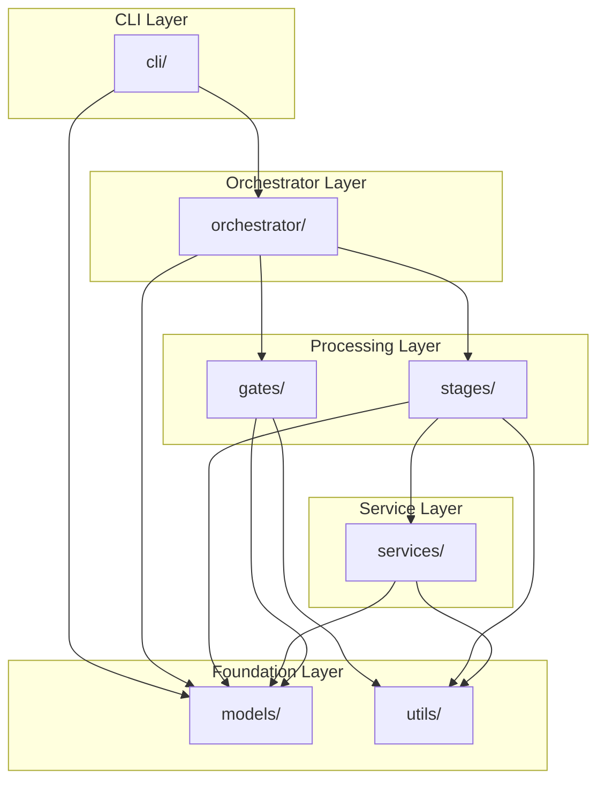

# リポジトリ構造定義書 (Repository Structure Document)

## プロジェクト構造

```
scan2mesh/
├── src/
│   └── scan2mesh/            # メインパッケージ
│       ├── __init__.py
│       ├── __main__.py       # エントリポイント
│       ├── cli/              # CLIレイヤー
│       ├── orchestrator/     # パイプラインオーケストレーター
│       ├── stages/           # 処理ステージ
│       ├── services/         # 共通サービス
│       ├── models/           # データモデル
│       ├── gates/            # 品質ゲート
│       └── utils/            # ユーティリティ
├── tests/                    # テストコード
│   ├── unit/                 # ユニットテスト
│   ├── integration/          # 統合テスト
│   ├── e2e/                  # E2Eテスト
│   └── fixtures/             # テストデータ
├── docker/                   # Docker関連ファイル
│   ├── Dockerfile
│   └── docker-compose.yml
├── config/                   # 設定ファイル
│   ├── default.yaml          # デフォルト設定
│   └── presets/              # 出力プリセット
├── scripts/                  # 開発・運用スクリプト
├── docs/                     # プロジェクトドキュメント
└── projects/                 # プロジェクトデータ（gitignore）
```

## ディレクトリ詳細

### src/scan2mesh/ (メインパッケージ)

#### cli/

**役割**: ユーザー入力の受付、バリデーション、結果の表示

**配置ファイル**:
- `__init__.py`: CLIアプリケーション定義
- `commands.py`: サブコマンド定義（init, plan, capture, etc.）
- `display.py`: 出力表示（テーブル、プログレスバー）
- `validators.py`: CLI引数バリデーション

**命名規則**:
- ファイル名: snake_case
- クラス名: PascalCase
- 関数名: snake_case

**依存関係**:
- 依存可能: `orchestrator/`, `models/`, `utils/`
- 依存禁止: `stages/`, `services/`（直接呼び出し禁止）

**例**:
```
cli/
├── __init__.py
├── commands.py           # @app.command() デコレータでコマンド定義
├── display.py            # rich を使った出力表示
└── validators.py         # Typer の callback バリデーション
```

#### orchestrator/

**役割**: パイプラインの実行管理、ステージ間の遷移、品質ゲート判定

**配置ファイル**:
- `__init__.py`: オーケストレーター公開インターフェース
- `pipeline.py`: パイプライン実行ロジック
- `recovery.py`: エラーリカバリー、中断・再開管理

**命名規則**:
- クラス名: `PipelineOrchestrator`, `RecoveryManager`

**依存関係**:
- 依存可能: `stages/`, `gates/`, `models/`, `services/`
- 依存禁止: `cli/`

**例**:
```
orchestrator/
├── __init__.py
├── pipeline.py           # PipelineOrchestrator クラス
└── recovery.py           # RecoveryManager クラス
```

#### stages/

**役割**: 各処理ステージの具体的なロジック実装

**配置ファイル**:
- `__init__.py`: ステージインターフェース定義
- `init.py`: ProjectInitializer
- `plan.py`: CapturePlanner
- `capture.py`: RGBDCapture
- `preprocess.py`: Preprocessor
- `reconstruct.py`: Reconstructor
- `optimize.py`: AssetOptimizer
- `package.py`: Packager
- `report.py`: QualityReporter

**命名規則**:
- ファイル名: ステージ名（snake_case）
- クラス名: ステージ名（PascalCase）

**依存関係**:
- 依存可能: `services/`, `models/`, `utils/`
- 依存禁止: `cli/`, `orchestrator/`, 他の `stages/`（直接呼び出し禁止）

**例**:
```
stages/
├── __init__.py           # StageInterface プロトコル定義
├── init.py               # ProjectInitializer
├── plan.py               # CapturePlanner
├── capture.py            # RGBDCapture
├── preprocess.py         # Preprocessor
├── reconstruct.py        # Reconstructor
├── optimize.py           # AssetOptimizer
├── package.py            # Packager
└── report.py             # QualityReporter
```

#### services/

**役割**: ステージ間で共有される機能（ストレージ、カメラ制御など）

**配置ファイル**:
- `__init__.py`: サービス公開インターフェース
- `storage.py`: ファイル保存・読み込み
- `camera.py`: RealSenseカメラ制御
- `mesh.py`: メッシュ操作（Open3D, trimesh）
- `image.py`: 画像処理（OpenCV）

**命名規則**:
- ファイル名: 機能名（snake_case）
- クラス名: `XxxService`（PascalCase）

**依存関係**:
- 依存可能: `models/`, `utils/`
- 依存禁止: `cli/`, `orchestrator/`, `stages/`

**例**:
```
services/
├── __init__.py
├── storage.py            # StorageService
├── camera.py             # CameraService
├── mesh.py               # MeshService
└── image.py              # ImageService
```

#### models/

**役割**: データモデル（Pydantic）、型定義

**配置ファイル**:
- `__init__.py`: 全モデルの再エクスポート
- `config.py`: ProjectConfig, OutputPreset, ScaleInfo
- `capture.py`: CapturePlan, ViewPoint, FrameData, CaptureMetrics
- `preprocess.py`: MaskedFrame, MaskMethod
- `reconstruct.py`: PoseEstimate, ReconReport
- `asset.py`: AssetMetrics, LODMetrics, CollisionMetrics
- `manifest.py`: AssetManifest, Provenance, QualityStatus

**命名規則**:
- ファイル名: 機能ドメイン名（snake_case）
- クラス名: データ名（PascalCase）

**依存関係**:
- 依存可能: なし（他のモジュールに依存しない）
- 依存禁止: 他のすべてのモジュール

**例**:
```
models/
├── __init__.py           # from .config import * など
├── config.py             # ProjectConfig, OutputPreset
├── capture.py            # CapturePlan, FrameData
├── preprocess.py         # MaskedFrame
├── reconstruct.py        # ReconReport
├── asset.py              # AssetMetrics
└── manifest.py           # AssetManifest
```

#### gates/

**役割**: 品質ゲート判定ロジック

**配置ファイル**:
- `__init__.py`: ゲートインターフェース定義
- `capture.py`: CaptureQualityGate
- `reconstruct.py`: ReconQualityGate
- `asset.py`: AssetQualityGate
- `thresholds.py`: 閾値定義

**命名規則**:
- ファイル名: ステージ名（snake_case）
- クラス名: `XxxQualityGate`

**依存関係**:
- 依存可能: `models/`, `utils/`
- 依存禁止: `cli/`, `orchestrator/`, `stages/`, `services/`

**例**:
```
gates/
├── __init__.py           # QualityGateInterface プロトコル
├── capture.py            # CaptureQualityGate
├── reconstruct.py        # ReconQualityGate
├── asset.py              # AssetQualityGate
└── thresholds.py         # DEPTH_VALID_RATIO_WARN = 0.7 など
```

#### utils/

**役割**: 汎用ユーティリティ関数

**配置ファイル**:
- `__init__.py`: ユーティリティ公開
- `hash.py`: ハッシュ計算（config hash等）
- `file.py`: ファイル操作（アトミック書き込み等）
- `math.py`: 数学関数（座標変換等）
- `logging.py`: ログ設定

**命名規則**:
- ファイル名: 機能名（snake_case）
- 関数名: snake_case

**依存関係**:
- 依存可能: なし
- 依存禁止: 他のすべてのモジュール

**例**:
```
utils/
├── __init__.py
├── hash.py               # calculate_config_hash()
├── file.py               # save_json_atomic()
├── math.py               # transform_coordinate_system()
└── logging.py            # setup_logging()
```

### tests/ (テストディレクトリ)

#### unit/

**役割**: ユニットテストの配置

**構造**:
```
tests/unit/
├── conftest.py           # pytest fixtures
├── stages/
│   ├── test_init.py
│   ├── test_plan.py
│   └── ...
├── services/
│   ├── test_storage.py
│   └── ...
├── gates/
│   ├── test_capture.py
│   └── ...
└── models/
    ├── test_config.py
    └── ...
```

**命名規則**:
- パターン: `test_[テスト対象ファイル名].py`
- 例: `storage.py` → `test_storage.py`

#### integration/

**役割**: 統合テストの配置

**構造**:
```
tests/integration/
├── conftest.py           # 統合テスト用fixtures
├── test_pipeline_flow.py # パイプライン全体フロー
├── test_stage_chain.py   # ステージ間連携
└── test_quality_gate.py  # 品質ゲート連携
```

#### e2e/

**役割**: E2Eテストの配置

**構造**:
```
tests/e2e/
├── conftest.py           # E2Eテスト用fixtures
├── test_basic_workflow.py  # 基本ワークフロー
├── test_error_recovery.py  # エラーリカバリー
└── test_cli_commands.py    # CLIコマンド実行
```

#### fixtures/

**役割**: テストデータの配置

**構造**:
```
tests/fixtures/
├── sample_frames/        # サンプルRGBDフレーム
│   ├── frame_0000_rgb.png
│   └── frame_0000_depth.npy
├── sample_mesh/          # サンプルメッシュ
│   └── cube.glb
└── configs/              # テスト用設定
    └── test_project.json
```

### docker/ (Docker関連)

**配置ファイル**:
- `Dockerfile`: マルチステージビルド定義
- `docker-compose.yml`: サービス定義
- `docker-compose.dev.yml`: 開発用オーバーライド
- `.dockerignore`: ビルド除外設定

**例**:
```
docker/
├── Dockerfile
├── docker-compose.yml
├── docker-compose.dev.yml
└── .dockerignore
```

### config/ (設定ファイル)

**配置ファイル**:
- `default.yaml`: デフォルト設定
- `presets/`: 出力プリセット定義
  - `canonical.yaml`: 標準プリセット
  - `high_quality.yaml`: 高品質プリセット

**例**:
```
config/
├── default.yaml
└── presets/
    ├── canonical.yaml
    └── high_quality.yaml
```

### scripts/ (スクリプト)

**配置ファイル**:
- `build.sh`: Dockerイメージビルド
- `test.sh`: テスト実行
- `lint.sh`: リント実行
- `generate_sample_data.py`: サンプルデータ生成

**例**:
```
scripts/
├── build.sh
├── test.sh
├── lint.sh
└── generate_sample_data.py
```

### docs/ (ドキュメント)

**配置ドキュメント**:
- `product-requirements.md`: プロダクト要求定義書
- `functional-design.md`: 機能設計書
- `architecture.md`: アーキテクチャ設計書
- `repository-structure.md`: リポジトリ構造定義書（本ドキュメント）
- `development-guidelines.md`: 開発ガイドライン
- `glossary.md`: 用語集
- `ideas/`: アイデア・調査メモ

## ファイル配置規則

### ソースファイル

| ファイル種別 | 配置先 | 命名規則 | 例 |
|------------|--------|---------|-----|
| CLIコマンド | `cli/` | snake_case | `commands.py` |
| ステージ実装 | `stages/` | snake_case | `capture.py` |
| サービス | `services/` | snake_case | `storage.py` |
| データモデル | `models/` | snake_case | `config.py` |
| 品質ゲート | `gates/` | snake_case | `capture.py` |
| ユーティリティ | `utils/` | snake_case | `hash.py` |

### テストファイル

| テスト種別 | 配置先 | 命名規則 | 例 |
|-----------|--------|---------|-----|
| ユニットテスト | `tests/unit/[module]/` | `test_[対象].py` | `test_storage.py` |
| 統合テスト | `tests/integration/` | `test_[機能].py` | `test_pipeline_flow.py` |
| E2Eテスト | `tests/e2e/` | `test_[シナリオ].py` | `test_basic_workflow.py` |

### 設定ファイル

| ファイル種別 | 配置先 | 命名規則 |
|------------|--------|---------|
| デフォルト設定 | `config/` | `default.yaml` |
| プリセット | `config/presets/` | `[プリセット名].yaml` |
| Docker設定 | `docker/` | `Dockerfile`, `docker-compose*.yml` |
| ツール設定 | プロジェクトルート | `pyproject.toml`, `ruff.toml` |

## 命名規則

### ディレクトリ名

- **レイヤーディレクトリ**: 複数形、snake_case
  - 例: `stages/`, `services/`, `models/`
- **機能ディレクトリ**: 単数形、snake_case
  - 例: `config/`, `docker/`

### ファイル名

- **Pythonモジュール**: snake_case
  - 例: `capture.py`, `storage_service.py`
- **設定ファイル**: snake_case または kebab-case
  - 例: `default.yaml`, `docker-compose.yml`
- **ドキュメント**: kebab-case
  - 例: `repository-structure.md`

### クラス名・関数名

- **クラス名**: PascalCase
  - 例: `ProjectInitializer`, `CaptureQualityGate`
- **関数名**: snake_case
  - 例: `calculate_blur_score`, `save_json_atomic`
- **定数**: UPPER_SNAKE_CASE
  - 例: `DEPTH_VALID_RATIO_WARN`, `MAX_TRIANGLES_LOD0`

### テストファイル名

- パターン: `test_[テスト対象].py`
- 例: `test_storage.py`, `test_pipeline_flow.py`

## 依存関係のルール

### レイヤー間の依存

```
CLI Layer (cli/)
    ↓ (OK)
Orchestrator Layer (orchestrator/)
    ↓ (OK)
Processing Layer (stages/, gates/)
    ↓ (OK)
Service Layer (services/)
    ↓ (OK)
Model Layer (models/)
    ↓ (OK)
Utility Layer (utils/)
```

**禁止される依存**:
- `models/` → 他のレイヤー (❌)
- `utils/` → 他のレイヤー (❌)
- `services/` → `stages/` (❌)
- `stages/` → `orchestrator/` (❌)
- `stages/` → 他の `stages/` (❌)

### インポートルール

```python
# ✅ 良い例: 上位から下位への依存
# cli/commands.py
from scan2mesh.orchestrator import PipelineOrchestrator
from scan2mesh.models import ProjectConfig

# ✅ 良い例: 同一レイヤー内の依存
# stages/capture.py
from scan2mesh.services import CameraService, StorageService
from scan2mesh.models import FrameData, CaptureMetrics

# ❌ 悪い例: 下位から上位への依存
# services/storage.py
from scan2mesh.stages import CaptureStage  # 禁止！

# ❌ 悪い例: ステージ間の直接依存
# stages/preprocess.py
from scan2mesh.stages.capture import RGBDCapture  # 禁止！
```

### 循環依存の回避

**解決策: モデルレイヤーでの型定義**

```python
# models/interfaces.py
from typing import Protocol

class StorageServiceInterface(Protocol):
    def save_frame(self, frame: FrameData) -> None: ...
    def load_frame(self, frame_id: int) -> FrameData: ...

# stages/capture.py
from scan2mesh.models.interfaces import StorageServiceInterface

class RGBDCapture:
    def __init__(self, storage: StorageServiceInterface):
        self.storage = storage
```

## スケーリング戦略

### 機能の追加

新しいステージや機能を追加する際の方針:

1. **新ステージの追加**:
   - `stages/` に新ファイルを追加
   - `orchestrator/pipeline.py` にステージを登録
   - `gates/` に対応する品質ゲートを追加

2. **新サービスの追加**:
   - `services/` に新ファイルを追加
   - 既存ステージから利用

3. **新モデルの追加**:
   - `models/` に新ファイルを追加
   - `models/__init__.py` で再エクスポート

### ファイルサイズの管理

**ファイル分割の目安**:
- 1ファイル: 400行以下を推奨
- 400-600行: リファクタリングを検討
- 600行以上: 分割を強く推奨

**分割方法**:
```python
# Before: 1ファイルに全機能
# stages/reconstruct.py (800行)

# After: 責務ごとに分割
# stages/reconstruct/
#   __init__.py          # Reconstructorのエクスポート
#   reconstructor.py     # メインクラス (200行)
#   pose_estimator.py    # 姿勢推定 (250行)
#   tsdf_fusion.py       # TSDFフュージョン (200行)
#   texture_generator.py # テクスチャ生成 (150行)
```

## 特殊ディレクトリ

### .steering/ (ステアリングファイル)

**役割**: 特定の開発作業における「今回何をするか」を定義

**構造**:
```
.steering/
└── [YYYYMMDD]-[task-name]/
    ├── requirements.md      # 今回の作業の要求内容
    ├── design.md            # 変更内容の設計
    └── tasklist.md          # タスクリスト
```

**命名規則**: `20260105-add-turntable-support` 形式

### .claude/ (Claude Code設定)

**役割**: Claude Code設定とカスタマイズ

**構造**:
```
.claude/
├── settings.json         # 設定
├── commands/             # スラッシュコマンド
└── skills/               # タスクモード別スキル
```

### projects/ (プロジェクトデータ)

**役割**: スキャンプロジェクトのデータ保存（gitignore対象）

**構造**:
```
projects/
└── [project_name]/
    ├── project.json
    ├── raw_frames/
    ├── masked_frames/
    ├── recon/
    ├── asset/
    └── metrics/
```

## ルートディレクトリのファイル

| ファイル | 用途 |
|---------|------|
| `pyproject.toml` | プロジェクト設定、依存関係 |
| `uv.lock` | 依存関係ロックファイル |
| `ruff.toml` | Ruff設定 |
| `README.md` | プロジェクト概要 |
| `LICENSE` | ライセンス |
| `CLAUDE.md` | Claude Code用プロジェクト指示 |
| `.gitignore` | Git除外設定 |
| `.python-version` | Pythonバージョン指定 |

## 除外設定

### .gitignore

```gitignore
# Python
__pycache__/
*.py[cod]
*.egg-info/
.eggs/
dist/
build/

# 仮想環境
.venv/
venv/

# IDE
.idea/
.vscode/
*.swp

# テスト・カバレッジ
.pytest_cache/
.coverage
htmlcov/

# プロジェクトデータ
projects/

# ログ
*.log
logs/

# 一時ファイル
.steering/
*.tmp

# OS
.DS_Store
Thumbs.db

# Docker
docker/.env
```

### .dockerignore

```dockerignore
.git/
.gitignore
.github/
docs/
tests/
projects/
.steering/
.claude/
*.md
!README.md
.pytest_cache/
.coverage
htmlcov/
.venv/
__pycache__/
*.py[cod]
```

## 依存関係図


